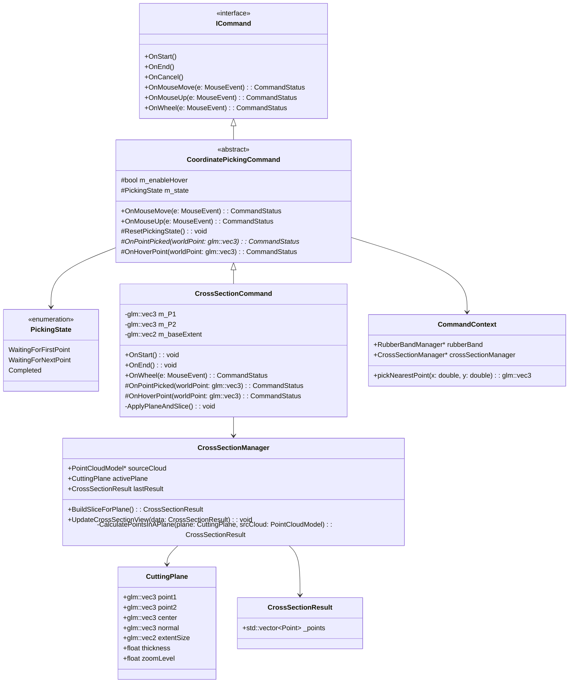

**CrossSectionCommand** class
```
class CrossSectionCommand : public CoordinatePickingCommand {
private:
    glm::vec3 m_P1{0.0f};
    glm::vec3 m_P2{0.0f};
    glm::vec2 m_baseExtent{100.0f, 80.0f}; // base size for zoom scaling

    // Helper: run slice + update view
    void ApplyPlaneAndSlice() {
        if (!m_context.crossSectionManager ||
            !m_context.crossSectionManager->sourceCloud) {
            return;
        }

        CrossSectionManager* manager = m_context.crossSectionManager;

        CrossSectionResult slicedResult = manager->BuildSliceForPlane();
        manager->UpdateCrossSectionView(slicedResult);
    }

public:
    using CoordinatePickingCommand::CoordinatePickingCommand;

    const char* GetName() const override { return "Cross Section"; }

    void OnStart() override {
        ResetPickingState();
        m_P1 = glm::vec3(0.0f);
        m_P2 = glm::vec3(0.0f);
        m_context.rubberBand->Clear();
        
        CuttingPlane& plane = m_context.crossSectionManager->activePlane;
        m_enableHover = true;
    }

    void OnEnd() override {
        m_context.rubberBand->Clear();
    }

protected:
    CommandStatus OnHoverPoint(const glm::vec3& hoverPoint) override {
        if (m_state == PickingState::WaitingForNextPoint) {
            m_context.rubberBand->ShowLine(m_P1, hoverPoint);
        }
        return CommandStatus::Finished;
    }

    // Handle click points in world space
    CommandStatus OnPointPicked(const glm::vec3& pickedPoint) override {

        CuttingPlane& plane = m_context.crossSectionManager->activePlane;

        switch (m_state) {
        case PickingState::WaitingForFirstPoint: {
            // First click -> choose start point P1
            m_P1 = pickedPoint;
            plane.point1 = m_P1;
            m_state = PickingState::WaitingForNextPoint;
            return CommandStatus::Finished;
        }

        case PickingState::WaitingForNextPoint: {
            // Second click -> choose P2, build plane
            m_P2 = pickedPoint;
            plane.point2 = m_P2;

            glm::vec3 dir = m_P2 - m_P1;
            if (glm::length2(dir) > 0.0f) {
                plane.normal = glm::normalize(dir);
            }
            plane.center = m_P1;

            ApplyPlaneAndSlice();
            m_state = PickingState::Completed;      // plane created
            return CommandStatus::Finished;          // keep command alive for move/zoom
        }

        case PickingState::Completed: {
            // plane already exists -> move plane center along line P1–P2
            plane.center = FindNearestPointToTheLine(pickedPoint, m_P1, m_P2);
            ApplyPlaneAndSlice();
            return CommandStatus::Finished;
        }
        }

        return CommandStatus::None;
    }

public:
    // Wheel zoom on the cross-section view
    CommandStatus OnWheel(const MouseEvent& e) override {
        if (m_state != PickingState::Completed)
            return CommandStatus::None;

        CuttingPlane& plane = m_context.crossSectionManager->activePlane;

        float zoomFactor = 1.0f + static_cast<float>(e.wheelDelta) * 0.1f;
        plane.zoomLevel *= zoomFactor;
        plane.zoomLevel = glm::clamp(plane.zoomLevel, 0.1f, 10.0f);

        float scale = 1.0f / plane.zoomLevel;
        plane.extentSize = m_baseExtent * scale;

        ApplyPlaneAndSlice();
        return CommandStatus::None;
    }
};

```

**CrossSectionManager** Structure
```
//  Data Structure for the Slicing Plane
struct CuttingPlane {
    glm::vec3 point1{0.0f, 0.0f, 0.0f};
    glm::vec3 point2{0.0f, 0.0f, 0.0f};
    glm::vec3 center{0.0f, 0.0f, 0.0f};
    glm::vec3 normal{0.0f, 0.0f, 1.0f};

    // width and height of the plane 
    glm::vec2 extentSize = glm::vec2(100.0f, 80.0f);
    float thickness;
    float zoomLevel = 1.0f;     
};

// Contain points data that in Cutting plane
struct CrossSectionResult {     
        std::vector<Point>  _points;
};

class CrossSectionManager {
public:
    CuttingPlane activePlane; 
    CrossSectionResult  lastResult;
    const PointCloudModel* sourceCloud{nullptr};

    CrossSectionResult BuildSliceForPlane() {
        lastResult = CalculatePointsInAPlane(activePlane, sourceCloud);
        return lastResult
    }

    void UpdateCrossSectionView(const CrossSectionResult& data) {
        // Update view , Passing Points data to renderer
        // Render active Plane
    }
private:
    CrossSectionResult CalculatePointsInAPlane(const CuttingPlane& plane, const PointCloudModel& srcCloud);
};

// CommandContext remains the same
struct CommandContext {
    RubberBandManager* rubberBand;
    CrossSectionManager* crossSectionManager;

    glm::vec3 pickNearestPoint(double x, double y);
    //...
};
```
