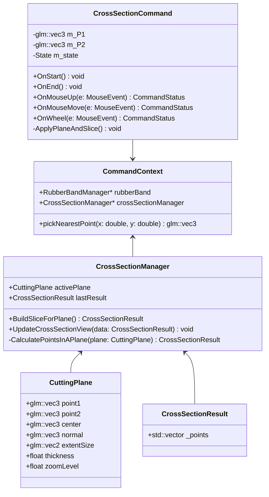

Class Diagram


CuttingPlane Structure
```
//  Data Structure for the Slicing Plane
struct CuttingPlane {
    glm::vec3 point1{0.0f, 0.0f, 0.0f};
    glm::vec3 point2{0.0f, 0.0f, 0.0f};
    glm::vec3 center{0.0f, 0.0f, 0.0f};
    glm::vec3 normal{0.0f, 0.0f, 1.0f};

    // width and height of the plane 
    glm::vec2 extentSize = glm::vec2(100.0f, 80.0f);
    float thickness;
    float zoomLevel = 1.0f;     
};

// Contain points data that in Cutting plane
struct CrossSectionResult {     
        std::vector<Point>  _points;
};

class CrossSectionManager {
public:
    CuttingPlane activePlane; 
    CrossSectionResult  lastResult;

    CrossSectionResult BuildSliceForPlane() {
        lastResult = CalculatePointsInAPlane(activePlane);
        return lastResult
    }

    void UpdateCrossSectionView(const CrossSectionResult& data) {
        // Update view , Passing Points data to renderer
        // Render active Plane
    }
private:
    CrossSectionResult CalculatePointsInAPlane(const CuttingPlane& plane);
};

// CommandContext remains the same
struct CommandContext {
    RubberBandManager* rubberBand;
    CrossSectionManager* crossSectionManager;

    glm::vec3 pickNearestPoint(double x, double y);
    //...
};
```

```
class CrossSectionCommand : public ICommand {
private:
    glm::vec3 m_P1(0.0f), m_P2(0.0f);
    State m_state;
    enum State {
        Idle,
        AwaitingP2,
        PlaneCreated
    };

    void ApplyPlaneAndSlice() {
        //  Build slice
        CrossSectionResult slicedResult = m_context.crossSectionManager->BuildSliceForPlane();
        
        // Update cross section view, passing data to renderer
        m_context.crossSectionManager->UpdateCrossSectionView(slicedResult);
    }

public:

    void OnStart() override {
        m_state = Idle;
        m_P1 = glm::vec3(0.0f);
        m_P2 = glm::vec3(0.0f);
        m_context.rubberBand->Clear();
        
        // Initialize active plane state
        CuttingPlane& plane = m_context.crossSectionManager->activePlane;
    }

    void OnEnd() override {
        m_context.rubberBand->Clear();
    }

    CommandStatus OnMouseUp(const MouseEvent& e) override {
        if (e.button != MouseButton::Left || e.gesture != GestureType::Click) 
            return CommandStatus::None;
        
        glm::vec3 clickPoint = m_context.pickNearestPoint(e.x, e.y);
        CuttingPlane& plane = m_context.crossSectionManager->activePlane;

        switch (m_state) {
            case Idle: // Waiting for first ppint
            {
                m_P1 = clickPoint;
                plane.point1 = m_P1;
                m_state = AwaitingP2;
                break;
            }
            case AwaitingP2: // Waiting for 2nd ppint
            {
                m_P2 = clickPoint;
                plane.point1 = m_P2;
                glm::vec3 dir = m_P2 - m_P1;
                plane.normal = glm::normalize(dir);
                plane.center = m_P1;
                        
                ApplyPlaneAndSlice();
                m_state = PlaneCreated;
                break;
            }
            case PlaneCreated: // If Planed is created
            {
                plane.center = FineNearestPointToTheLine ( clickPoint, m_P1, m_P2 )            
                ApplyPlaneAndSlice();
                break;
            }
        }
        return CommandStatus::Finished;
    }


    CommandStatus OnMouseMove(const MouseEvent& e) override {
        // Move the rubber band
    }

    CommandStatus OnWheel(const MouseEvent& e) override {
        if (m_state == PlaneCreated) {
            CuttingPlane& plane = m_context.crossSectionManager->activePlane;
            
            float zoomFactor = 1.0f + (e.wheelDelta * 0.1f);
            plane.zoomLevel *= zoomFactor;
            plane.zoomLevel = glm::clamp(plane.zoomLevel, 0.1f, 10.0f); 

            float scale = 1.0f / plane.zoomLevel;
            plane.extentSize = m_baseExtent * scale;
            
            ApplyPlaneAndSlice();
        }
        return CommandStatus::Finished;
    }
};
```
