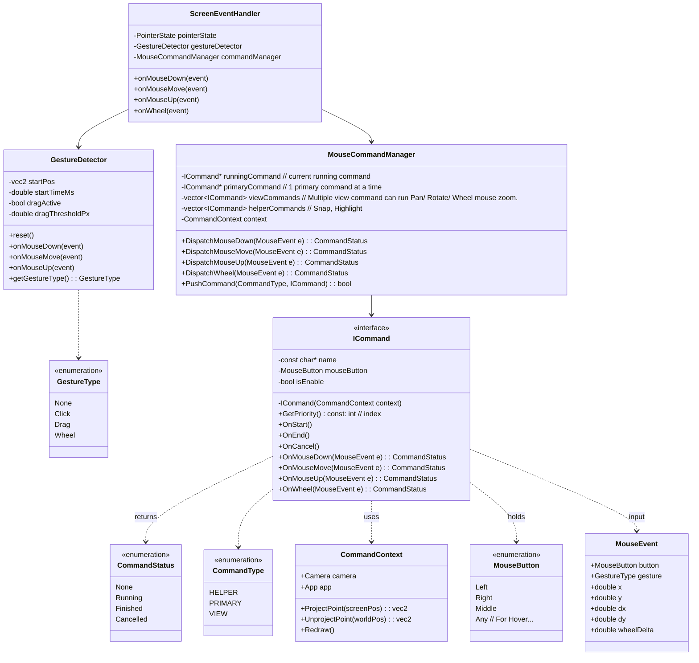
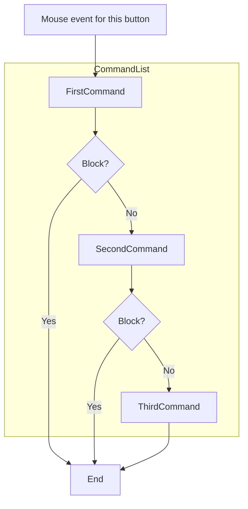
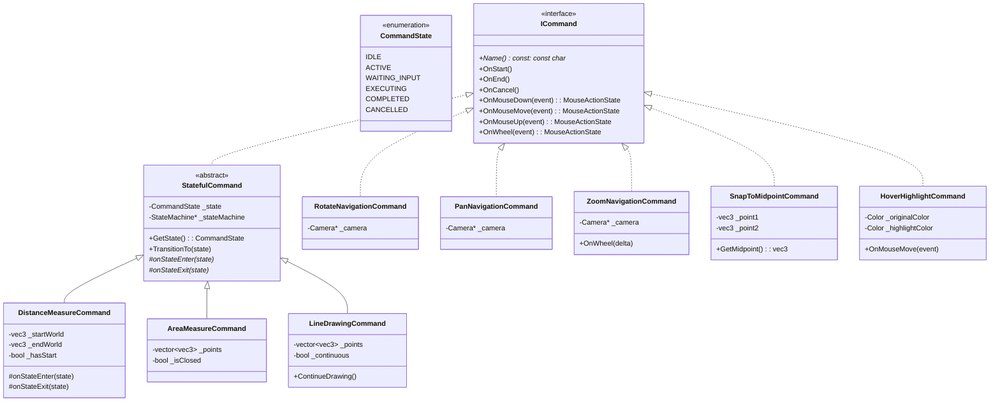

```
CommandStatus DispatchMouseDown(MouseEvent& e) {
        // If has running command
        if(runningCommand!=nullptr)
        {    
            CommandStatus status = runningCommand->OnMouseDown(e);
            if (status == CommandStatus::Finished || status == CommandStatus::Cancel) {
                runningCommand = nullptr;
            }
            return status; 
        }
    
        // [LAYER 1] Helper
        for (auto helper : helperCommands) {
            helper->OnMouseDown(e); 
        }

        // [LAYER 2] View Commands (Pan, Rotate)
        for (auto view : viewCommands) {
            CommandStatus status = view->OnMouseDown(e);
            if (status == CommandStatus::Running) {
                runningCommand = view;
                return status; 
            }
        }

        // [LAYER 3] Primary Command (Draw Line, Select)
        if (primaryCommand) {
            CommandStatus status = primaryCommand->OnMouseDown(e);
            if(status == CommandStatus::Running){
                 runningCommand = primaryCommand;
            }
            else if (status == CommandStatus::Finished) {
                primaryCommand->OnEnd();
            } else if (status == CommandStatus::Cancelled) {
                primaryCommand->OnCancel();
            }
            
            return status;
        }

        return CommandStatus::None;
    }
```




