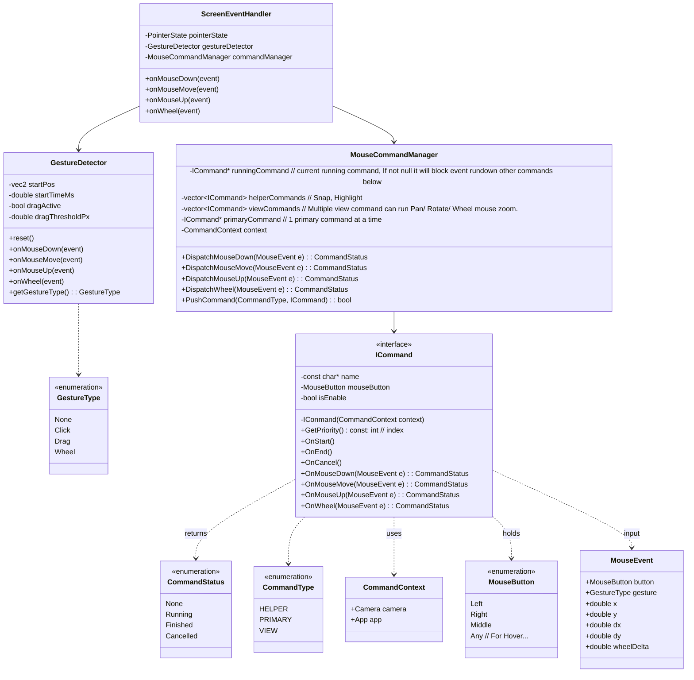

MouseCommandManager manages three layers of commands:
- Helper commands (e.g. snap, highlight)
- View commands (e.g. pan, rotate, wheel zoom)
- a single active Primary command (e.g. distance measurement, selection) 
It also keeps a single runningCommand, which captures subsequent events while it is in the Running state and blocks them from going down to lower layers.

When a mouse event is received, MouseCommandManager:
1. Send event to runningCommand (if not null). If result == Running → stop.
2. Else dispatch to below commands in order: Helper → View → Primary.
3. If a command that returns Running state. Set as new runningCommand.




Here is the example of a mouse event routing

```
CommandStatus DispatchMouseDown(MouseEvent& e) {
        // If has running command
        if(runningCommand!=nullptr)
        {    
            CommandStatus status = runningCommand->OnMouseDown(e);
            if (status == CommandStatus::Finished || status == CommandStatus::Canceled) {
                runningCommand = nullptr;
                // Allow event from go down below
            } else if (status == CommandStatus::Running )
                return status; // Stop event from go down below
        }
    
        // [LAYER 1] Helper
        for (auto helper : helperCommands) {
             CommandStatus status =helper->OnMouseDown(e);
             if (status == CommandStatus::Running) {
                runningCommand = helper;
                return status; 
            }
        }

        // [LAYER 2] View Commands (Pan, Rotate)
        for (auto view : viewCommands) {
            CommandStatus status = view->OnMouseDown(e);
            if (status == CommandStatus::Running) {
                runningCommand = view;
                return status; 
            }
        }

        // [LAYER 3] Primary Command (Draw Line, Select)
        if (primaryCommand) {
            CommandStatus status = primaryCommand->OnMouseDown(e);
            if(status == CommandStatus::Running){
                 runningCommand = primaryCommand;
            }
            else if (status == CommandStatus::Finished) {
                primaryCommand->OnEnd();
            } else if (status == CommandStatus::Cancelled) {
                primaryCommand->OnCancel();
            }
            
            return status;
        }

        return CommandStatus::None;
    }
```

