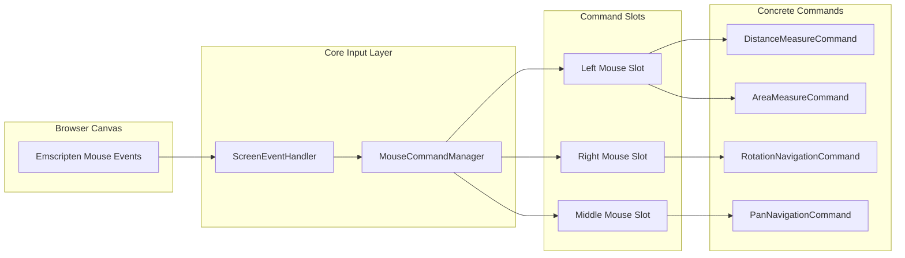
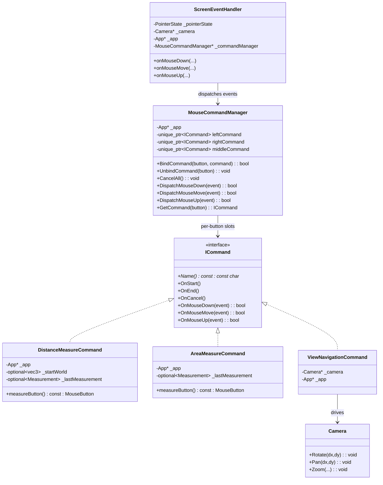
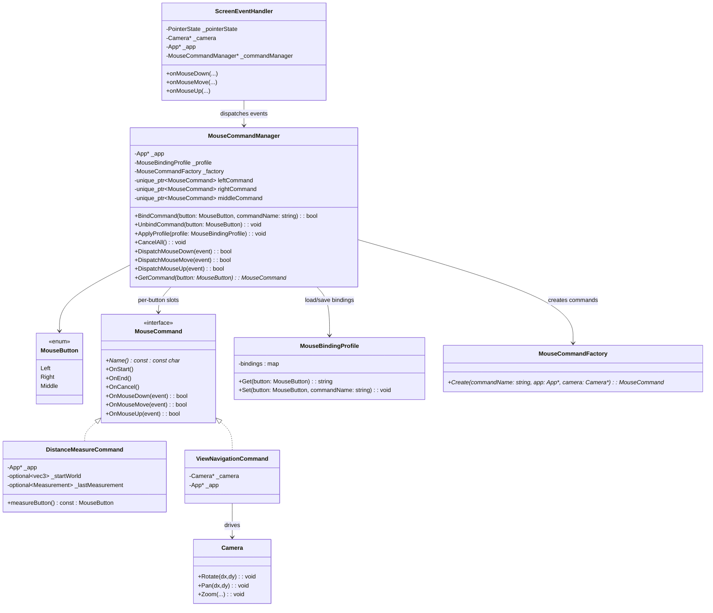

```mermaid
flowchart LR
    subgraph Input["Browser Canvas"]
        Raw["Emscripten Mouse Events"]
    end

    Raw --> Router["ScreenEventHandler"]

    subgraph Core["Core Input Layer"]
        Router --> CM["MouseCommandManager"]
    end

    subgraph Slots["Command Slots"]
        LSlot["Left Mouse Slot"]
        RSlot["Right Mouse Slot"]
        MSlot["Middle Mouse Slot"]
    end

    CM --> LSlot
    CM --> RSlot
    CM --> MSlot

    subgraph Commands["Concrete Commands"]
        DMC["DistanceMeasureCommand"]
        RNC["RotationNavigationCommand"]
        AMC["AreaMeasureCommand"]
        PNC["PanNavigationCommand"]
    end

    LSlot --> DMC
    LSlot --> AMC
    RSlot --> RNC
    MSlot --> PNC

    %% --- New: Binding / Settings path ---

    subgraph Binding["Mouse Binding UI / Settings"]
        Settings["Mouse Settings Panel"]
        Profile["MouseBindingProfile (saved config)"]
    end

    Settings -->|user chooses button + command| CM
    Profile -->|ApplyProfile()| CM

    CM -->|BindCommand(Left, DistanceMeasure)| LSlot
    CM -->|BindCommand(Right, RotationNav)| RSlot
    CM -->|BindCommand(Middle, PanNav)| MSlot
```


