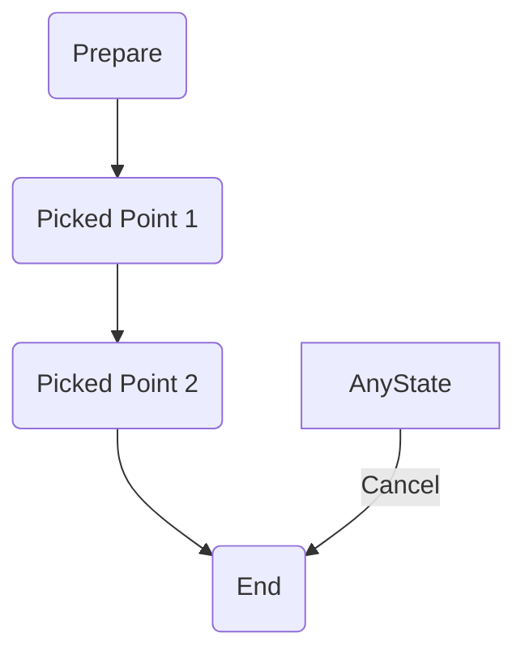
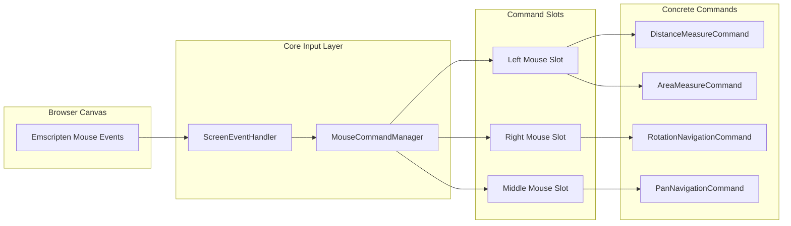
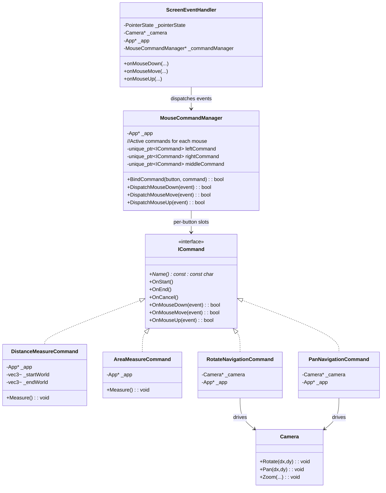
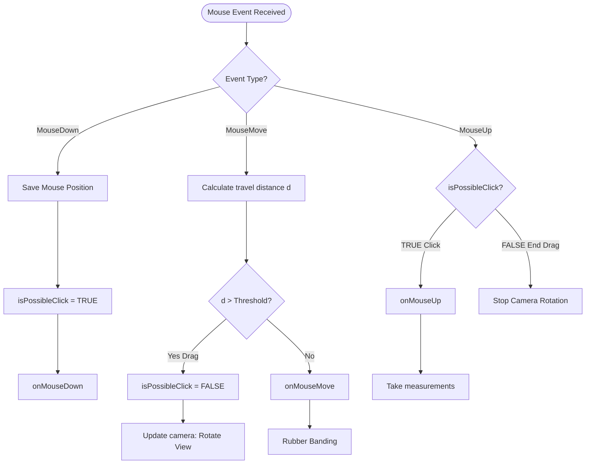

**CommandPattern:**
- We will use CommandPattern for main Pattern to store active commands of left/right/middle
- We may need to combine with StateMachine and Event Dispatcher 

**State Machine:**
=> Use to store state of each command : 
For example distance measurement: 

**View operatation(rotate/ pan) vs Click operation**
=> Right now we treated the same
**Middle Mouse Scroll**
- Dont have interface like click action?
  => need to create a separated Command.

**Temporary Architecture Graph ( In Progress )**

**Implementing event routing for dragging and clicking ( In Progress )**

