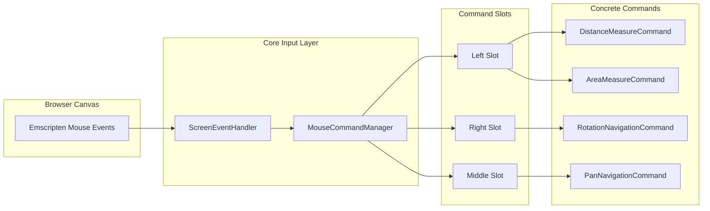
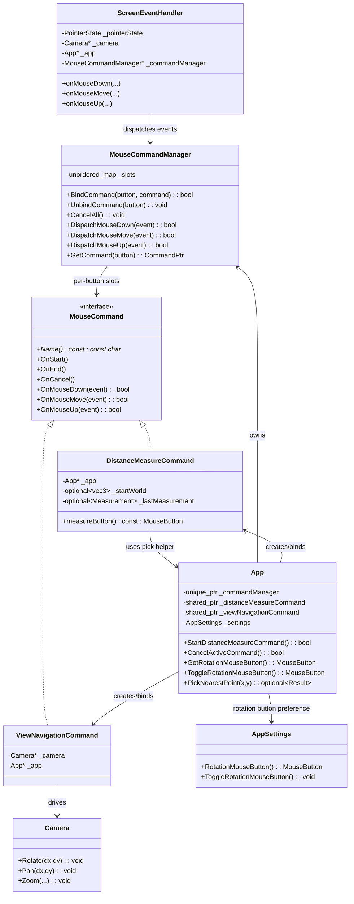

```mermaid
flowchart LR
    subgraph Input["Browser Canvas"]
        Raw["Emscripten Mouse Events"]
    end

    Raw --> Router["ScreenEventHandler"]

    subgraph Core["Core Input Layer"]
        Router --> CM["MouseCommandManager"]
    end

    subgraph Slots["Command Slots"]
        LSlot["Left Slot"]
        RSlot["Right Slot"]
        MSlot["Middle Slot"]
    end

    CM --> LSlot
    CM --> RSlot
    CM --> MSlot

    subgraph Commands["Concrete Commands"]
        DMC["DistanceMeasureCommand"]
        RNC["RotationNavigationCommand"]
        AMC["AreaMeasureCommand"]
        PNC["PanNavigationCommand"]
    end

    LSlot --> DMC
    RSlot --> RNC
    MSlot --> PNC
    LSlot --> AMC

```

```mermaid
classDiagram
    class ScreenEventHandler {
        -PointerState _pointerState
        -Camera* _camera
        -App* _app
        -MouseCommandManager* _commandManager
        +onMouseDown(...)
        +onMouseMove(...)
        +onMouseUp(...)
    }

    class MouseCommand {
        <<interface>>
        +Name() const : const char*
        +OnStart()
        +OnEnd()
        +OnCancel()
        +OnMouseDown(event): bool
        +OnMouseMove(event): bool
        +OnMouseUp(event): bool
    }

    class MouseCommandManager {
        -unordered_map<MouseButton,CommandPtr,MouseButtonHash> _slots
        +BindCommand(button, command): bool
        +UnbindCommand(button): void
        +CancelAll(): void
        +DispatchMouseDown(event): bool
        +DispatchMouseMove(event): bool
        +DispatchMouseUp(event): bool
        +GetCommand(button): CommandPtr
    }

    class DistanceMeasureCommand {
        -App* _app
        -optional~vec3~ _startWorld
        -optional~Measurement~ _lastMeasurement
        +measureButton() const : MouseButton
    }

    class ViewNavigationCommand {
        -Camera* _camera
        -App* _app
    }

    class App {
        -unique_ptr<MouseCommandManager> _commandManager
        -shared_ptr<DistanceMeasureCommand> _distanceMeasureCommand
        -shared_ptr<ViewNavigationCommand> _viewNavigationCommand
        -AppSettings _settings
        +StartDistanceMeasureCommand(): bool
        +CancelActiveCommand(): bool
        +GetRotationMouseButton(): MouseButton
        +ToggleRotationMouseButton(): MouseButton
        +PickNearestPoint(x,y): optional~Result~
    }

    class Camera {
        +Rotate(dx,dy): void
        +Pan(dx,dy): void
        +Zoom(...): void
    }

    class AppSettings {
        +RotationMouseButton(): MouseButton
        +ToggleRotationMouseButton(): void
    }

    MouseCommand <|.. DistanceMeasureCommand
    MouseCommand <|.. ViewNavigationCommand

    ScreenEventHandler --> MouseCommandManager : dispatches events


    MouseCommandManager --> MouseCommand : per-button slots
    App --> MouseCommandManager : owns
    App --> DistanceMeasureCommand : creates/binds
    App --> ViewNavigationCommand : creates/binds
    App --> AppSettings : rotation button preference
    ViewNavigationCommand --> Camera : drives
    DistanceMeasureCommand --> App : uses pick helper

```
