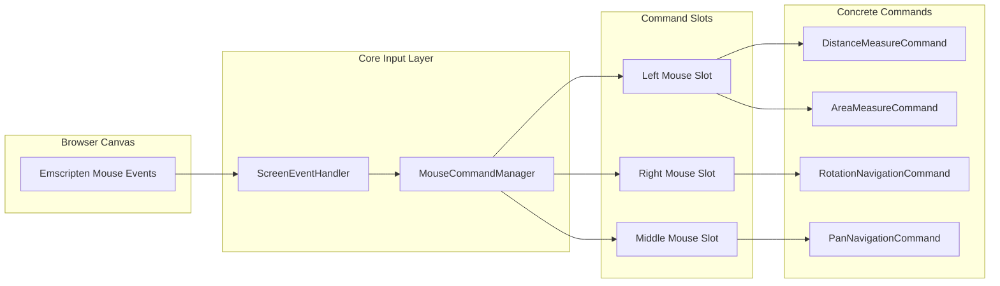
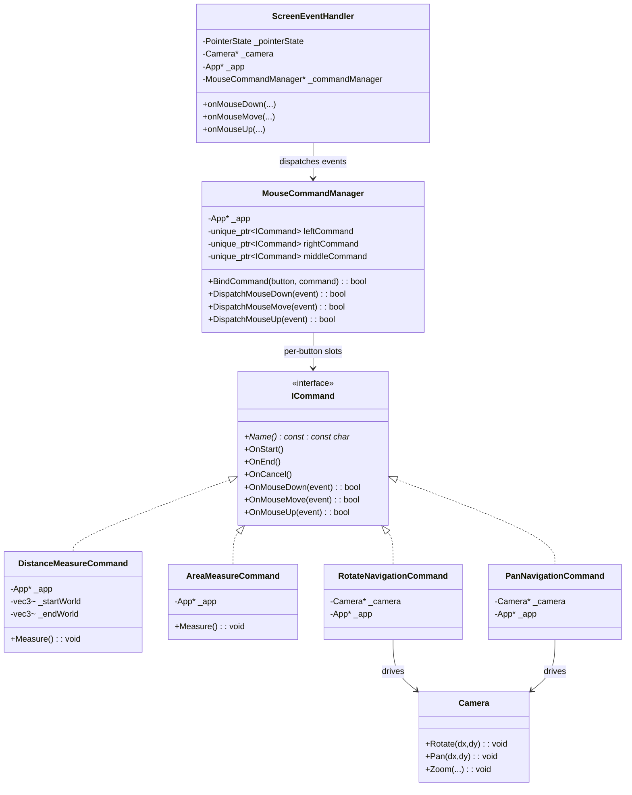

```mermaid
flowchart LR
    subgraph Input["Browser Canvas"]
        Raw["Emscripten Mouse Events"]
    end

    Raw --> Router["ScreenEventHandler"]

    subgraph Core["Core Input Layer"]
        Router --> CM["MouseCommandManager"]
    end

    subgraph Slots["Command Slots"]
        LSlot["Left Mouse Slot"]
        RSlot["Right Mouse Slot"]
        MSlot["Middle Mouse Slot"]
    end

    CM --> LSlot
    CM --> RSlot
    CM --> MSlot

    subgraph Commands["Concrete Commands"]
        DMC["DistanceMeasureCommand"]
        RNC["RotationNavigationCommand"]
        AMC["AreaMeasureCommand"]
        PNC["PanNavigationCommand"]
    end

    LSlot --> DMC
    RSlot --> RNC
    MSlot --> PNC
    LSlot --> AMC
```

State Machine:
We can use state machine to decide Command for left/right/middle mouse

Event Dispatcher:
...

```mermaid
classDiagram
    class ScreenEventHandler {
        -PointerState _pointerState
        -Camera* _camera
        -App* _app
        -MouseCommandManager* _commandManager
        +onMouseDown(...)
        +onMouseMove(...)
        +onMouseUp(...)
    }

    class ICommand {
        <<interface>>
        +Name() const : const char*
        +OnStart()
        +OnEnd()
        +OnCancel()
        +OnMouseDown(event): bool
        +OnMouseMove(event): bool
        +OnMouseUp(event): bool
    }

    class MouseCommandManager {
        -App* _app
        -unique_ptr~ICommand~ leftCommand
        -unique_ptr~ICommand~ rightCommand
        -unique_ptr~ICommand~ middleCommand
        +BindCommand(button, command): bool
        +DispatchMouseDown(event): bool
        +DispatchMouseMove(event): bool
        +DispatchMouseUp(event): bool
    }

    class DistanceMeasureCommand {
        -App* _app
        -vec3~ _startWorld
        -vec3~ _endWorld
        +Measure(): void
    }

    class AreaMeasureCommand {
        -App* _app
        +Measure() : void
    }

    class PanNavigationCommand {
        -Camera* _camera
        -App* _app
    }

    class RotateNavigationCommand {
        -Camera* _camera
        -App* _app
    }

    class Camera {
        +Rotate(dx,dy): void
        +Pan(dx,dy): void
        +Zoom(...): void
    }


    ICommand <|.. DistanceMeasureCommand
    ICommand <|.. AreaMeasureCommand
    ICommand <|.. RotateNavigationCommand
    ICommand <|.. PanNavigationCommand

    ScreenEventHandler --> MouseCommandManager : dispatches events
    MouseCommandManager --> ICommand : per-button slots
    RotateNavigationCommand --> Camera : drives
    PanNavigationCommand --> Camera : drives
```
