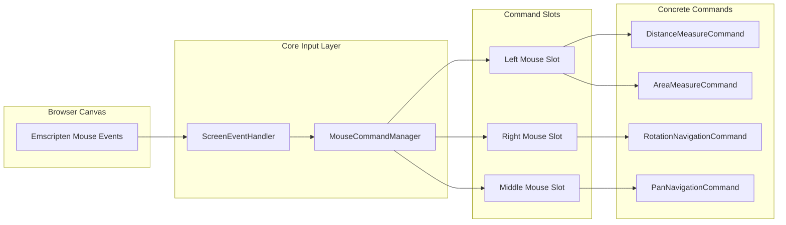
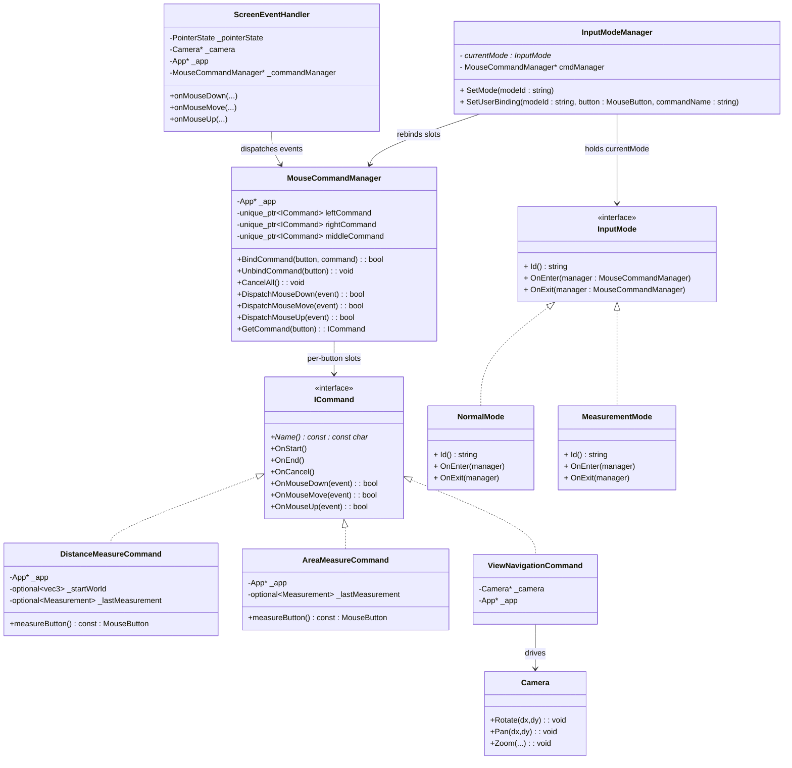

```mermaid
flowchart LR
    subgraph Input["Browser Canvas"]
        Raw["Emscripten Mouse Events"]
    end

    Raw --> Router["ScreenEventHandler"]

    subgraph Core["Core Input Layer"]
        Router --> CM["MouseCommandManager"]
    end

    subgraph Slots["Command Slots"]
        LSlot["Left Mouse Slot"]
        RSlot["Right Mouse Slot"]
        MSlot["Middle Mouse Slot"]
    end

    CM --> LSlot
    CM --> RSlot
    CM --> MSlot

    subgraph Commands["Concrete Commands"]
        DMC["DistanceMeasureCommand"]
        RNC["RotationNavigationCommand"]
        AMC["AreaMeasureCommand"]
        PNC["PanNavigationCommand"]
    end

    LSlot --> DMC
    RSlot --> RNC
    MSlot --> PNC
    LSlot --> AMC
```

```mermaid
classDiagram
    class ScreenEventHandler {
        -PointerState _pointerState
        -Camera* _camera
        -App* _app
        -MouseCommandManager* _commandManager
        +onMouseDown(...)
        +onMouseMove(...)
        +onMouseUp(...)
    }

    class ICommand {
        <<interface>>
        +Name() const : const char*
        +OnStart()
        +OnEnd()
        +OnCancel()
        +OnMouseDown(event): bool
        +OnMouseMove(event): bool
        +OnMouseUp(event): bool
    }

    class MouseCommandManager {
        -App* _app
        -unique_ptr~ICommand~ leftCommand
        -unique_ptr~ICommand~ rightCommand
        -unique_ptr~ICommand~ middleCommand
        +BindCommand(button, command): bool
        +UnbindCommand(button): void
        +CancelAll(): void
        +DispatchMouseDown(event): bool
        +DispatchMouseMove(event): bool
        +DispatchMouseUp(event): bool
        +GetCommand(button): ICommand
    }

    class DistanceMeasureCommand {
        -App* _app
        -optional~vec3~ _startWorld
        -optional~Measurement~ _lastMeasurement
        +measureButton() const : MouseButton
    }

    class AreaMeasureCommand {
        -App* _app
        -optional~Measurement~ _lastMeasurement
        +measureButton() const : MouseButton
    }

    class ViewNavigationCommand {
        -Camera* _camera
        -App* _app
    }

    class Camera {
        +Rotate(dx,dy): void
        +Pan(dx,dy): void
        +Zoom(...): void
    }

    class InputMode {
        <<interface>>
        + Id() string
        + OnEnter(manager : MouseCommandManager)
        + OnExit(manager : MouseCommandManager)
    }

    class NormalMode {
        + Id() string
        + OnEnter(manager)
        + OnExit(manager)
    }

    class MeasurementMode {
        + Id() string
        + OnEnter(manager)
        + OnExit(manager)
    }

    class InputModeManager {
        - currentMode : InputMode*
        - MouseCommandManager* cmdManager
        + SetMode(modeId : string)
        + SetUserBinding(modeId : string, button : MouseButton, commandName : string)
    }

    ICommand <|.. DistanceMeasureCommand
    ICommand <|.. ViewNavigationCommand
    ICommand <|.. AreaMeasureCommand

    ScreenEventHandler --> MouseCommandManager : dispatches events
    MouseCommandManager --> ICommand : per-button slots
    ViewNavigationCommand --> Camera : drives

    InputMode <|.. NormalMode
    InputMode <|.. MeasurementMode

    InputModeManager --> InputMode : holds currentMode
    InputModeManager --> MouseCommandManager : rebinds slots
```

```mermaid
classDiagram
    class ScreenEventHandler {
        -PointerState _pointerState
        -Camera* _camera
        -App* _app
        -MouseCommandManager* _commandManager
        +onMouseDown(...)
        +onMouseMove(...)
        +onMouseUp(...)
    }

    class MouseButton {
        <<enum>>
        Left
        Right
        Middle
    }

    class MouseCommand {
        <<interface>>
        +Name() const : const char*
        +OnStart()
        +OnEnd()
        +OnCancel()
        +OnMouseDown(event): bool
        +OnMouseMove(event): bool
        +OnMouseUp(event): bool
    }

    class MouseBindingProfile {
        -bindings : map
        +Get(button: MouseButton) : string
        +Set(button: MouseButton, commandName: string) : void
    }

    class MouseCommandFactory {
        +Create(commandName: string, app: App*, camera: Camera*): MouseCommand*
    }

    class MouseCommandManager {
        -App* _app
        -MouseBindingProfile _profile
        -MouseCommandFactory _factory
        -unique_ptr~MouseCommand~ leftCommand
        -unique_ptr~MouseCommand~ rightCommand
        -unique_ptr~MouseCommand~ middleCommand
        +BindCommand(button: MouseButton, commandName: string): bool
        +UnbindCommand(button: MouseButton): void
        +ApplyProfile(profile: MouseBindingProfile): void
        +CancelAll(): void
        +DispatchMouseDown(event): bool
        +DispatchMouseMove(event): bool
        +DispatchMouseUp(event): bool
        +GetCommand(button: MouseButton): MouseCommand*
    }

    class DistanceMeasureCommand {
        -App* _app
        -optional~vec3~ _startWorld
        -optional~Measurement~ _lastMeasurement
        +measureButton() const : MouseButton
    }

    class ViewNavigationCommand {
        -Camera* _camera
        -App* _app
    }

    class Camera {
        +Rotate(dx,dy): void
        +Pan(dx,dy): void
        +Zoom(...): void
    }

    MouseCommand <|.. DistanceMeasureCommand
    MouseCommand <|.. ViewNavigationCommand

    ScreenEventHandler --> MouseCommandManager : dispatches events
    MouseCommandManager --> MouseCommand : per-button slots
    MouseCommandManager --> MouseBindingProfile : load/save bindings
    MouseCommandManager --> MouseCommandFactory : creates commands
    MouseCommandManager --> MouseButton
    ViewNavigationCommand --> Camera : drives
```

```mermaid
classDiagram
    class ScreenEventHandler {
        - pointerState
        - Camera* camera
        - App* app
        - MouseCommandManager* commandManager
        + onMouseDown(event)
        + onMouseMove(event)
        + onMouseUp(event)
    }

    class MouseButton {
        <<enum>>
        Left
        Right
        Middle
    }

    class MouseCommand {
        <<interface>>
        + Name() const : string
        + OnStart()
        + OnEnd()
        + OnCancel()
        + OnMouseDown(event) bool
        + OnMouseMove(event) bool
        + OnMouseUp(event) bool
    }

    class MouseCommandManager {
        - App* app
        - MouseCommand* leftCommand
        - MouseCommand* rightCommand
        - MouseCommand* middleCommand
        + BindCommand(button : MouseButton, cmd : MouseCommand*)
        + UnbindCommand(button : MouseButton)
        + CancelAll()
        + DispatchMouseDown(event) bool
        + DispatchMouseMove(event) bool
        + DispatchMouseUp(event) bool
        + GetCommand(button : MouseButton) MouseCommand*
    }

    class MouseCommandFactory {
        + Create(commandName : string, app : App*, camera : Camera*) MouseCommand*
    }

    class MouseBindingProfile {
        - bindings : map(MouseButton,string)  "button -> commandName"
        + Get(button : MouseButton) string
        + Set(button : MouseButton, commandName : string)
    }

    class InputMode {
        <<interface>>
        + Id() string
        + BuildDefaultProfile(profile : MouseBindingProfile)
        + OnEnter(manager : MouseCommandManager, factory : MouseCommandFactory)
        + OnExit(manager : MouseCommandManager)
    }

    class NormalMode {
        + Id() string
        + BuildDefaultProfile(profile : MouseBindingProfile)
        + OnEnter(manager, factory)
        + OnExit(manager)
    }

    class MeasurementMode {
        + Id() string
        + BuildDefaultProfile(profile : MouseBindingProfile)
        + OnEnter(manager, factory)
        + OnExit(manager)
    }

    class InputModeManager {
        - currentMode : InputMode*
        - MouseCommandManager* cmdManager
        - MouseCommandFactory* factory
        - defaultProfiles : map(string, MouseBindingProfile)  "modeId -> defaults"
        - userOverrides : map(string, MouseBindingProfile)    "modeId -> overrides"
        + SetMode(modeId : string)
        + SetUserBinding(modeId : string, button : MouseButton, commandName : string)
        + ApplyBindingsFor(modeId : string)
    }

    class DistanceMeasureCommand {
        - App* app
        - startWorld
        - lastMeasurement
    }

    class RotationNavigationCommand {
        - Camera* camera
        - App* app
    }

    class PanNavigationCommand {
        - Camera* camera
        - App* app
    }

    class AreaMeasureCommand {
        - App* app
    }

    class Camera {
        + Rotate(dx,dy)
        + Pan(dx,dy)
        + Zoom(...)
    }

    ScreenEventHandler --> MouseCommandManager : dispatches events
    MouseCommand <|.. DistanceMeasureCommand
    MouseCommand <|.. RotationNavigationCommand
    MouseCommand <|.. PanNavigationCommand
    MouseCommand <|.. AreaMeasureCommand

    InputMode <|.. NormalMode
    InputMode <|.. MeasurementMode

    InputModeManager --> InputMode : holds currentMode
    InputModeManager --> MouseCommandManager : rebinds slots
    InputModeManager --> MouseCommandFactory : creates commands
    InputModeManager --> MouseBindingProfile : default + overrides
```
