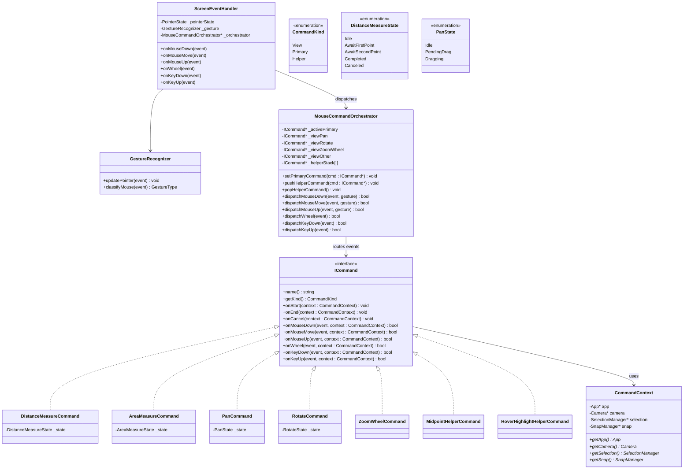
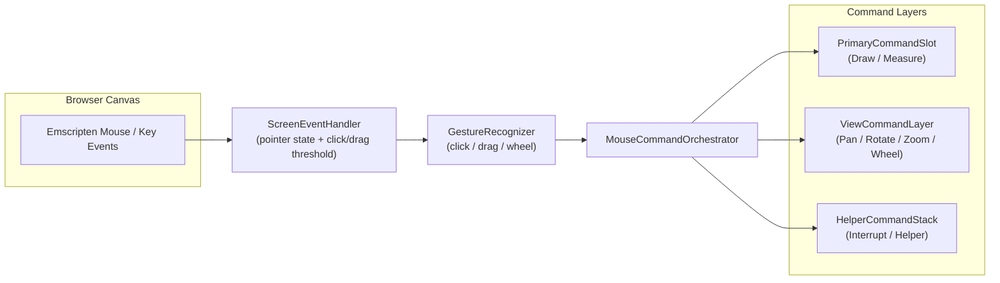

```mermaid
classDiagram
    class ScreenEventHandler {
        -PointerState _pointerState
        -GestureRecognizer _gesture
        -MouseCommandOrchestrator* _orchestrator
        +onMouseDown(event)
        +onMouseMove(event)
        +onMouseUp(event)
        +onWheel(event)
        +onKeyDown(event)
        +onKeyUp(event)
    }

    class GestureRecognizer {
        +updatePointer(event) void
        +classifyMouse(event) GestureType
    }

    class MouseCommandOrchestrator {
        -ICommand* _activePrimary
        -ICommand* _viewPan
        -ICommand* _viewRotate
        -ICommand* _viewZoomWheel
        -ICommand* _viewOther
        -ICommand* _helperStack[ ]
        +setPrimaryCommand(cmd : ICommand*) void
        +pushHelperCommand(cmd : ICommand*) void
        +popHelperCommand() void
        +dispatchMouseDown(event, gesture) bool
        +dispatchMouseMove(event, gesture) bool
        +dispatchMouseUp(event, gesture) bool
        +dispatchWheel(event) bool
        +dispatchKeyDown(event) bool
        +dispatchKeyUp(event) bool
    }

    class ICommand {
        <<interface>>
        +name() string
        +getKind() CommandKind
        +onStart(context : CommandContext) void
        +onEnd(context : CommandContext) void
        +onCancel(context : CommandContext) void
        +onMouseDown(event, context : CommandContext) bool
        +onMouseMove(event, context : CommandContext) bool
        +onMouseUp(event, context : CommandContext) bool
        +onWheel(event, context : CommandContext) bool
        +onKeyDown(event, context : CommandContext) bool
        +onKeyUp(event, context : CommandContext) bool
    }

    class CommandKind {
        <<enumeration>>
        View
        Primary
        Helper
    }

    class CommandContext {
        -App* app
        -Camera* camera
        -SelectionManager* selection
        -SnapManager* snap
        +getApp() App*
        +getCamera() Camera*
        +getSelection() SelectionManager*
        +getSnap() SnapManager*
    }

    class DistanceMeasureCommand {
        -DistanceMeasureState _state
    }

    class AreaMeasureCommand {
        -AreaMeasureState _state
    }

    class PanCommand {
        -PanState _state
    }

    class RotateCommand {
        -RotateState _state
    }

    class ZoomWheelCommand {
    }

    class MidpointHelperCommand {
    }

    class HoverHighlightHelperCommand {
    }

    class DistanceMeasureState {
        <<enumeration>>
        Idle
        AwaitFirstPoint
        AwaitSecondPoint
        Completed
        Canceled
    }

    class PanState {
        <<enumeration>>
        Idle
        PendingDrag
        Dragging
    }

    ICommand <|.. DistanceMeasureCommand
    ICommand <|.. AreaMeasureCommand
    ICommand <|.. PanCommand
    ICommand <|.. RotateCommand
    ICommand <|.. ZoomWheelCommand
    ICommand <|.. MidpointHelperCommand
    ICommand <|.. HoverHighlightHelperCommand

    ScreenEventHandler --> GestureRecognizer
    ScreenEventHandler --> MouseCommandOrchestrator : dispatches
    MouseCommandOrchestrator --> ICommand : routes events
    ICommand --> CommandContext : uses

```

```mermaid
flowchart LR
    subgraph Input["Browser Canvas"]
        Raw["Emscripten Mouse / Key Events"]
    end

    Raw --> SEH["ScreenEventHandler\n(pointer state + click/drag threshold)"]
    SEH --> GR["GestureRecognizer\n(click / drag / wheel)"]
    GR --> ORCH["MouseCommandOrchestrator"]

    subgraph Layers["Command Layers"]
        Primary["PrimaryCommandSlot\n(Draw / Measure)"]
        View["ViewCommandLayer\n(Pan / Rotate / Zoom / Wheel)"]
        Helper["HelperCommandStack\n(Interrupt / Helper)"]
    end

    ORCH --> Primary
    ORCH --> View
    ORCH --> Helper

```
