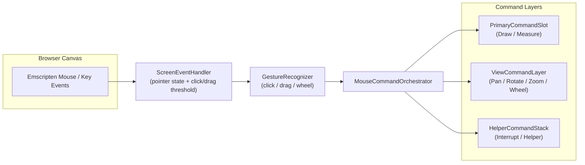
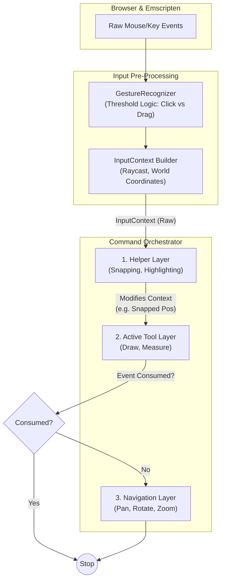

```mermaid
classDiagram
    %% --- Data Structures ---
    class InputContext {
        +vec2 ScreenPos
        +vec3 WorldPos
        +vec3 SnappedWorldPos
        +EntityID HoveredEntity
        +vec2 Delta
        +bool IsDragging
        +bool IsClick
    }

    class InputResult {
        <<enumeration>>
        Ignored
        Consumed
        Passthrough
    }

    %% --- Core Handler ---
    class ScreenEventHandler {
        -GestureRecognizer _recognizer
        -CommandOrchestrator* _orchestrator
        -App* _app
        +OnRawEvent(eventType, x, y)
        -BuildInputContext() : InputContext
    }

    class GestureRecognizer {
        -vec2 _mouseDownPos
        -float _dragThreshold
        +UpdateState(x, y, isDown)
        +IsDragging() : bool
    }

    %% --- Command Interface ---
    class ICommand {
        <<interface>>
        +GetName() : string
        +OnEnter()
        +OnExit()
        +HandleInput(InputContext) : InputResult
        +DrawGizmos()
    }

    %% --- The Manager ---
    class CommandOrchestrator {
        -vector~ICommand*~ _helpers  // Snapping, Highlight
        -ICommand* _activeTool       // Measure, DrawLine
        -ICommand* _navigation       // Pan/Zoom/Rotate
        
        +SetTool(ICommand*)
        +DispatchInput(InputContext)
    }

    %% --- Concrete Commands ---
    class SnappingHelper {
        -Scene* _scene
        +HandleInput(ctx) : InputResult
        %% Modifies ctx.SnappedWorldPos
    }

    class DistanceMeasureCommand {
        <<State Machine>>
        -enum State { IDLE, WAITING_PT2, FINISHED }
        -State _state
        -vec3 _startPoint
        -vec3 _currentEndPoint
        +HandleInput(ctx) : InputResult
    }

    class NavigationCommand {
        -Camera* _cam
        +HandleInput(ctx) : InputResult
    }

    %% --- Relationships ---
    ScreenEventHandler --> GestureRecognizer : Uses
    ScreenEventHandler --> CommandOrchestrator : Drives
    CommandOrchestrator --> ICommand : Manages
    CommandOrchestrator ..> InputContext : Creates/Passes

    ICommand <|.. SnappingHelper
    ICommand <|.. DistanceMeasureCommand
    ICommand <|.. NavigationCommand
    
    SnappingHelper --|> DistanceMeasureCommand : Provides Data via Context
```


