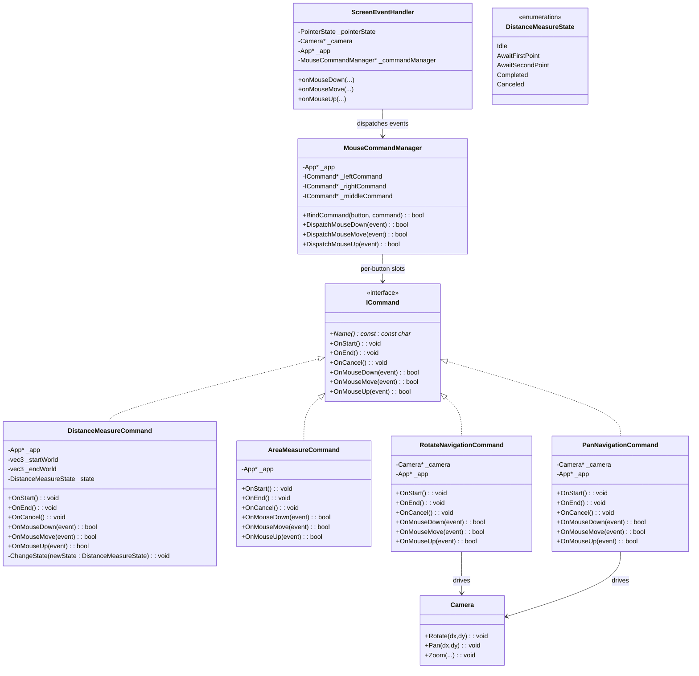
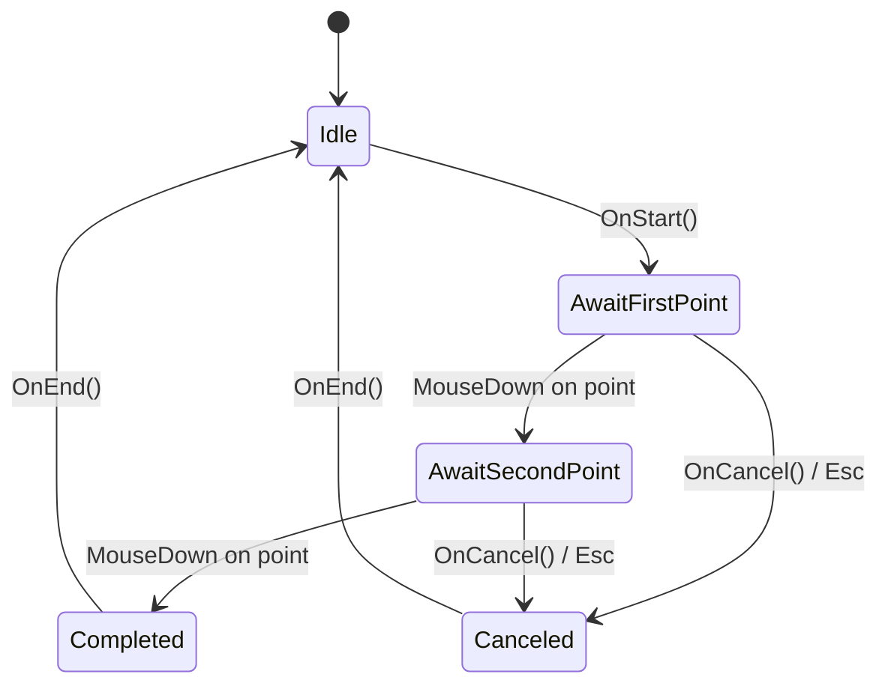

```mermaid
classDiagram
    class ScreenEventHandler {
        -PointerState _pointerState
        -Camera* _camera
        -App* _app
        -MouseCommandManager* _commandManager
        +onMouseDown(...)
        +onMouseMove(...)
        +onMouseUp(...)
    }

    class ICommand {
        <<interface>>
        +Name() const : const char*
        +OnStart() : void
        +OnEnd() : void
        +OnCancel() : void
        +OnMouseDown(event) : bool
        +OnMouseMove(event) : bool
        +OnMouseUp(event) : bool
    }

    class MouseCommandManager {
        -App* _app
        -ICommand* _leftCommand
        -ICommand* _rightCommand
        -ICommand* _middleCommand
        +BindCommand(button, command) : bool
        +DispatchMouseDown(event) : bool
        +DispatchMouseMove(event) : bool
        +DispatchMouseUp(event) : bool
    }

    class DistanceMeasureCommand {
        -App* _app
        -vec3 _startWorld
        -vec3 _endWorld
        -DistanceMeasureState _state
        +OnStart() : void
        +OnEnd() : void
        +OnCancel() : void
        +OnMouseDown(event) : bool
        +OnMouseMove(event) : bool
        +OnMouseUp(event) : bool
        -ChangeState(newState : DistanceMeasureState) : void
    }

    class DistanceMeasureState {
        <<enumeration>>
        Idle
        AwaitFirstPoint
        AwaitSecondPoint
        Completed
        Canceled
    }

    class AreaMeasureCommand {
        -App* _app
        +OnStart() : void
        +OnEnd() : void
        +OnCancel() : void
        +OnMouseDown(event) : bool
        +OnMouseMove(event) : bool
        +OnMouseUp(event) : bool
    }

    class PanNavigationCommand {
        -Camera* _camera
        -App* _app
        +OnStart() : void
        +OnEnd() : void
        +OnCancel() : void
        +OnMouseDown(event) : bool
        +OnMouseMove(event) : bool
        +OnMouseUp(event) : bool
    }

    class RotateNavigationCommand {
        -Camera* _camera
        -App* _app
        +OnStart() : void
        +OnEnd() : void
        +OnCancel() : void
        +OnMouseDown(event) : bool
        +OnMouseMove(event) : bool
        +OnMouseUp(event) : bool
    }

    class Camera {
        +Rotate(dx,dy) : void
        +Pan(dx,dy) : void
        +Zoom(...) : void
    }

    ICommand <|.. DistanceMeasureCommand
    ICommand <|.. AreaMeasureCommand
    ICommand <|.. RotateNavigationCommand
    ICommand <|.. PanNavigationCommand

    ScreenEventHandler --> MouseCommandManager : dispatches events
    MouseCommandManager --> ICommand : per-button slots
    RotateNavigationCommand --> Camera : drives
    PanNavigationCommand --> Camera : drives
```

```mermaid
stateDiagram-v2
    [*] --> Idle

    Idle --> AwaitFirstPoint : OnStart()
    AwaitFirstPoint --> AwaitSecondPoint : MouseDown on point
    AwaitSecondPoint --> Completed : MouseDown on point

    AwaitFirstPoint --> Canceled : OnCancel() / Esc
    AwaitSecondPoint --> Canceled : OnCancel() / Esc
    Completed --> Idle : OnEnd()
    Canceled --> Idle : OnEnd()
```
