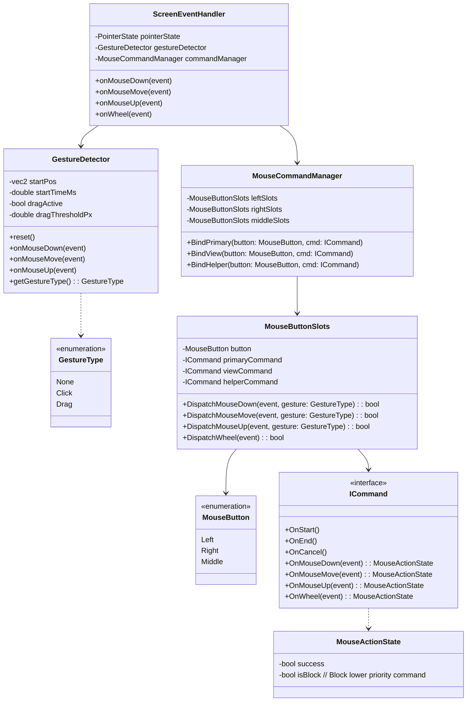
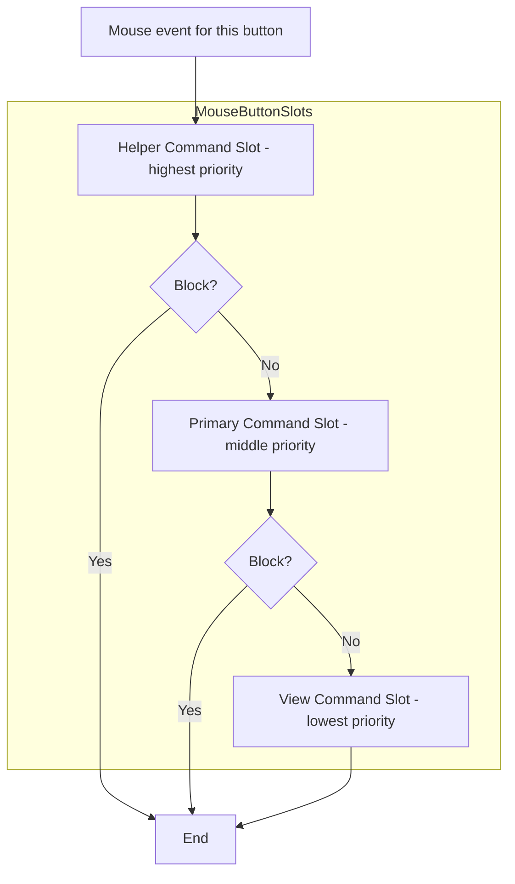
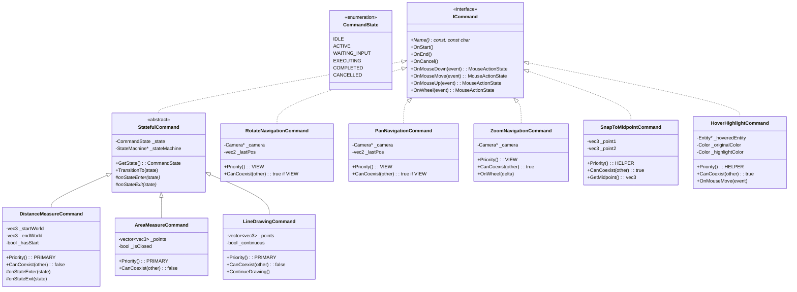

```mermaid
classDiagram
    class MouseButton {
        <<enumeration>>
        Left
        Right
        Middle
    }

    class GestureType {
        <<enumeration>>
        None
        Click
        Drag
    }

    class MouseActionState {
        -bool success
        -bool isBlock // Block lower priority command
    }

    class ScreenEventHandler {
        -PointerState pointerState
        -GestureDetector gestureDetector
        -MouseCommandManager commandManager
        +onMouseDown(event)
        +onMouseMove(event)
        +onMouseUp(event)
        +onWheel(event)
    }

    class GestureDetector {
        -vec2 startPos
        -double startTimeMs
        -bool dragActive
        -double dragThresholdPx
        +reset()
        +onMouseDown(event)
        +onMouseMove(event)
        +onMouseUp(event)
        +getGestureType(): GestureType
    }

    class ICommand {
        <<interface>>
        +OnStart()
        +OnEnd()
        +OnCancel()
        +OnMouseDown(event): MouseActionState
        +OnMouseMove(event): MouseActionState
        +OnMouseUp(event): MouseActionState
        +OnWheel(event): MouseActionState
    }

    class MouseButtonSlots {
        -MouseButton button
        -ICommand primaryCommand
        -ICommand viewCommand
        -ICommand helperCommand
        +DispatchMouseDown(event, gesture: GestureType): bool
        +DispatchMouseMove(event, gesture: GestureType): bool
        +DispatchMouseUp(event, gesture: GestureType): bool
        +DispatchWheel(event): bool
    }

    class MouseCommandManager {
        -MouseButtonSlots leftSlots
        -MouseButtonSlots rightSlots
        -MouseButtonSlots middleSlots
        +BindPrimary(button: MouseButton, cmd: ICommand)
        +BindView(button: MouseButton, cmd: ICommand)
        +BindHelper(button: MouseButton, cmd: ICommand)
    }

    ScreenEventHandler --> GestureDetector
    ScreenEventHandler --> MouseCommandManager
    GestureDetector ..> GestureType

    MouseCommandManager --> MouseButtonSlots
    MouseButtonSlots --> MouseButton
    MouseButtonSlots --> ICommand
    ICommand ..> MouseActionState
```

```mermaid
flowchart TB
    Event[Mouse event for this button]
    End[End]
    subgraph MouseButtonSlots
        HelperSlot[Helper Command Slot - highest priority]
        Block1{Block?}
        PrimarySlot[Primary Command Slot - middle priority]
        Block2{Block?}
        ViewSlot[View Command Slot - lowest priority]
        
    end


    Event --> HelperSlot
    HelperSlot -->Block1 --> |No| PrimarySlot
    Block1 --> |Yes| End
    PrimarySlot -->Block2 --> |No| ViewSlot
    Block2 --> |Yes| End
    ViewSlot --> End
```

```mermaid
classDiagram
   class CommandState {
        <<enumeration>>
        IDLE
        ACTIVE
        WAITING_INPUT
        EXECUTING
        COMPLETED
        CANCELLED
    }
      class ICommand {
        <<interface>>
        +Name() const: const char*
        +OnStart()
        +OnEnd()
        +OnCancel()
        +OnMouseDown(event): MouseActionState
        +OnMouseMove(event): MouseActionState
        +OnMouseUp(event): MouseActionState
        +OnWheel(event): MouseActionState
    }
   class StatefulCommand {
        <<abstract>>
        -CommandState _state
        -StateMachine* _stateMachine
        +GetState(): CommandState
        +TransitionTo(state)
        #onStateEnter(state)*
        #onStateExit(state)*
    }
    
    class DistanceMeasureCommand {
        -vec3 _startWorld
        -vec3 _endWorld
        -bool _hasStart
        +Priority(): PRIMARY
        +CanCoexist(other): false
        #onStateEnter(state)
        #onStateExit(state)
    }
    
    class AreaMeasureCommand {
        -vector~vec3~ _points
        -bool _isClosed
        +Priority(): PRIMARY
        +CanCoexist(other): false
    }
    
    class LineDrawingCommand {
        -vector~vec3~ _points
        -bool _continuous
        +Priority(): PRIMARY
        +CanCoexist(other): false
        +ContinueDrawing()
    }
    
    class RotateNavigationCommand {
        -Camera* _camera
        -vec2 _lastPos
        +Priority(): VIEW
        +CanCoexist(other): true if VIEW
    }
    
    class PanNavigationCommand {
        -Camera* _camera
        -vec2 _lastPos
        +Priority(): VIEW
        +CanCoexist(other): true if VIEW
    }
    
    class ZoomNavigationCommand {
        -Camera* _camera
        +Priority(): VIEW
        +CanCoexist(other): true
        +OnWheel(delta)
    }
    
    class SnapToMidpointCommand {
        -vec3 _point1
        -vec3 _point2
        +Priority(): HELPER
        +CanCoexist(other): true
        +GetMidpoint(): vec3
    }
    
    class HoverHighlightCommand {
        -Entity* _hoveredEntity
        -Color _originalColor
        -Color _highlightColor
        +Priority(): HELPER
        +CanCoexist(other): true
        +OnMouseMove(event)
    }

    ICommand <|.. StatefulCommand
    StatefulCommand <|-- DistanceMeasureCommand
    StatefulCommand <|-- AreaMeasureCommand
    StatefulCommand <|-- LineDrawingCommand
    ICommand <|.. RotateNavigationCommand
    ICommand <|.. PanNavigationCommand
    ICommand <|.. ZoomNavigationCommand
    ICommand <|.. SnapToMidpointCommand
    ICommand <|.. HoverHighlightCommand
```
