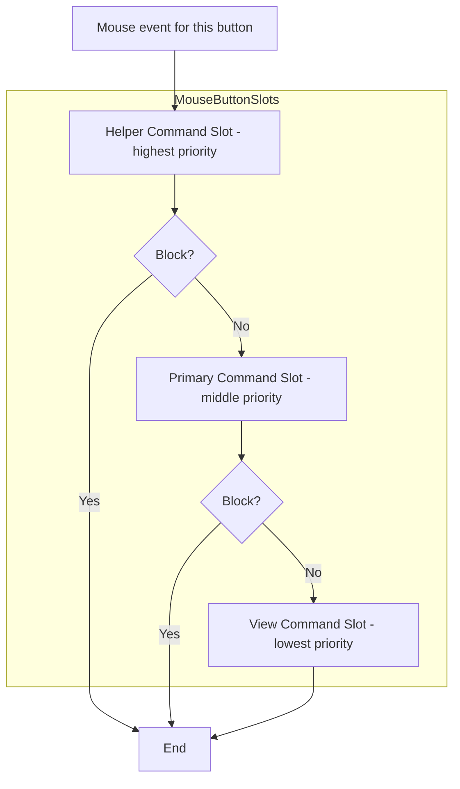

```mermaid
classDiagram
    class MouseButton {
        <<enumeration>>
        Left
        Right
        Middle
    }

    class GestureType {
        <<enumeration>>
        None
        Click
        Drag
    }

    class MouseActionState {
        -bool success
        -bool isBlock // Block lower priority command
    }

    class ScreenEventHandler {
        -PointerState pointerState
        -GestureDetector gestureDetector
        -MouseCommandManager commandManager
        +onMouseDown(event)
        +onMouseMove(event)
        +onMouseUp(event)
        +onWheel(event)
    }

    class GestureDetector {
        -vec2 startPos
        -double startTimeMs
        -bool dragActive
        -double dragThresholdPx
        +reset()
        +onMouseDown(event)
        +onMouseMove(event)
        +onMouseUp(event)
        +getGestureType(): GestureType
    }

    class ICommand {
        <<interface>>
        +OnStart()
        +OnEnd()
        +OnCancel()
        +OnMouseDown(event): MouseActionState
        +OnMouseMove(event): MouseActionState
        +OnMouseUp(event): MouseActionState
        +OnWheel(event): MouseActionState
    }

    class MouseButtonSlots {
        -MouseButton button
        -ICommand primaryCommand
        -ICommand viewCommand
        -ICommand helperCommand
        +DispatchMouseDown(event, gesture: GestureType): bool
        +DispatchMouseMove(event, gesture: GestureType): bool
        +DispatchMouseUp(event, gesture: GestureType): bool
        +DispatchWheel(event): bool
    }

    class MouseCommandManager {
        -MouseButtonSlots leftSlots
        -MouseButtonSlots rightSlots
        -MouseButtonSlots middleSlots
        +BindPrimary(button: MouseButton, cmd: ICommand)
        +BindView(button: MouseButton, cmd: ICommand)
        +BindHelper(button: MouseButton, cmd: ICommand)
    }

    ScreenEventHandler --> GestureDetector
    ScreenEventHandler --> MouseCommandManager
    GestureDetector --> GestureType

    MouseCommandManager --> MouseButtonSlots
    MouseButtonSlots --> MouseButton
    MouseButtonSlots --> ICommand
    ICommand --> MouseActionState
```

```mermaid
flowchart TB
    Event[Mouse event for this button]
    End[End]
    subgraph MouseButtonSlots
        HelperSlot[Helper Command Slot - highest priority]
        Block1{Block?}
        PrimarySlot[Primary Command Slot - middle priority]
        Block2{Block?}
        ViewSlot[View Command Slot - lowest priority]
        
    end


    Event --> HelperSlot
    HelperSlot -->Block1 --> |No| PrimarySlot
    Block1 --> |Yes| End
    PrimarySlot -->Block2 --> |No| ViewSlot
    Block2 --> |Yes| End
    ViewSlot --> End
```

```mermaid
classDiagram
    class CommandCategory {
        <<enumeration>>
        Primary
        View
        Helper
    }

    class ICommand {
        <<interface>>
        +GetCategory() CommandCategory
        +OnStart()
        +OnEnd()
        +OnCancel()
        +OnMouseDown(event) bool
        +OnMouseMove(event) bool
        +OnMouseUp(event) bool
        +OnWheel(event) bool
        +Update(deltaTime)
    }

    %% ===== Primary commands =====
    class DistanceMeasureState {
        <<enumeration>>
        Idle
        AwaitFirstPoint
        AwaitSecondPoint
        Completed
        Canceled
    }

    class DistanceMeasureCommand {
        -DistanceMeasureState state
        -vec3 startWorld
        -vec3 endWorld
        -bool hasStart
        +GetCategory() CommandCategory
        +OnStart()
        +OnEnd()
        +OnCancel()
        +OnMouseDown(event) bool
        +OnMouseMove(event) bool
        +OnMouseUp(event) bool
    }

    class LineDrawingState {
        <<enumeration>>
        Idle
        AwaitFirstPoint
        Drawing
        Completed
        Canceled
    }

    class LineDrawingCommand {
        -LineDrawingState state
        -list points
        +GetCategory() CommandCategory
        +OnStart()
        +OnEnd()
        +OnCancel()
        +OnMouseDown(event) bool
        +OnMouseMove(event) bool
        +OnMouseUp(event) bool
        +Update(deltaTime)
    }

    %% ===== View commands (pan, rotate, wheel) =====
    class RotateViewCommand {
        -Camera camera
        -vec2 lastPos
        +GetCategory() CommandCategory
        +OnStart()
        +OnEnd()
        +OnMouseDown(event) bool
        +OnMouseMove(event) bool
        +OnMouseUp(event) bool
    }

    class PanViewCommand {
        -Camera camera
        -vec2 lastPos
        +GetCategory() CommandCategory
        +OnStart()
        +OnEnd()
        +OnMouseDown(event) bool
        +OnMouseMove(event) bool
        +OnMouseUp(event) bool
    }

    class ZoomWheelCommand {
        -Camera camera
        +GetCategory() CommandCategory
        +OnStart()
        +OnEnd()
        +OnWheel(event) bool
    }

    %% ===== Helper commands (helper / お助け) =====
    class MidpointHelperCommand {
        -vec3 p1
        -vec3 p2
        -bool active
        +GetCategory() CommandCategory
        +OnStart()
        +OnEnd()
        +OnMouseDown(event) bool
        +GetMidpoint() vec3
    }

    class HoverHighlightCommand {
        -Entity hovered
        +GetCategory() CommandCategory
        +OnStart()
        +OnEnd()
        +OnMouseMove(event) bool
    }

    class Camera {
        +Rotate(dx, dy)
        +Pan(dx, dy)
        +Zoom(delta)
    }

    class Entity {
    }

    %% ===== Inheritance =====
    ICommand <|.. DistanceMeasureCommand
    ICommand <|.. LineDrawingCommand
    ICommand <|.. RotateViewCommand
    ICommand <|.. PanViewCommand
    ICommand <|.. ZoomWheelCommand
    ICommand <|.. MidpointHelperCommand
    ICommand <|.. HoverHighlightCommand

    %% ===== State associations =====
    DistanceMeasureCommand --> DistanceMeasureState
    LineDrawingCommand --> LineDrawingState

    %% ===== Category associations (optional visual hint) =====
    DistanceMeasureCommand ..> CommandCategory
    LineDrawingCommand ..> CommandCategory
    RotateViewCommand ..> CommandCategory
    PanViewCommand ..> CommandCategory
    ZoomWheelCommand ..> CommandCategory
    MidpointHelperCommand ..> CommandCategory
    HoverHighlightCommand ..> CommandCategory

    %% ===== Other associations =====
    RotateViewCommand --> Camera
    PanViewCommand --> Camera
    ZoomWheelCommand --> Camera

    HoverHighlightCommand --> Entity
    MidpointHelperCommand --> Entity
```
