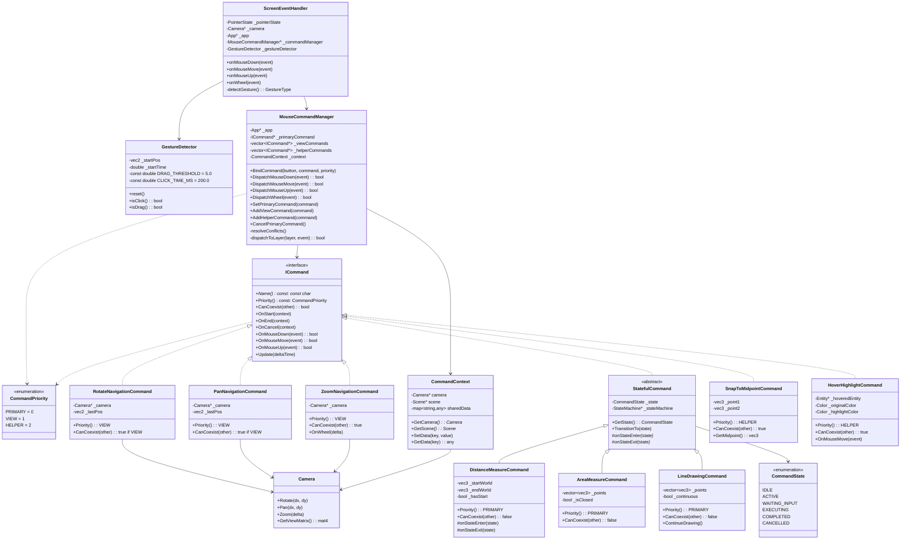

```mermaid
classDiagram
    class ScreenEventHandler {
        -PointerState _pointerState
        -Camera* _camera
        -App* _app
        -MouseCommandManager* _commandManager
        -GestureDetector _gestureDetector
        +onMouseDown(event)
        +onMouseMove(event)
        +onMouseUp(event)
        +onWheel(event)
        -detectGesture(): GestureType
    }
    
    class GestureDetector {
        -vec2 _startPos
        -double _startTime
        -const double DRAG_THRESHOLD = 5.0
        -const double CLICK_TIME_MS = 200.0
        +reset()
        +isClick(): bool
        +isDrag(): bool
    }
    
    class ICommand {
        <<interface>>
        +Name() const: const char*
        +Priority() const: CommandPriority
        +CanCoexist(other): bool
        +OnStart(context)
        +OnEnd(context)
        +OnCancel(context)
        +OnMouseDown(event): bool
        +OnMouseMove(event): bool
        +OnMouseUp(event): bool
        +Update(deltaTime)
    }
    
    class CommandState {
        <<enumeration>>
        IDLE
        ACTIVE
        WAITING_INPUT
        EXECUTING
        COMPLETED
        CANCELLED
    }
    
    class CommandPriority {
        <<enumeration>>
        PRIMARY = 0
        VIEW = 1
        HELPER = 2
    }
    
    class MouseCommandManager {
        -App* _app
        -ICommand* _primaryCommand
        -vector~ICommand*~ _viewCommands
        -vector~ICommand*~ _helperCommands
        -CommandContext _context
        +BindCommand(button, command, priority)
        +DispatchMouseDown(event): bool
        +DispatchMouseMove(event): bool
        +DispatchMouseUp(event): bool
        +DispatchWheel(event): bool
        +SetPrimaryCommand(command)
        +AddViewCommand(command)
        +AddHelperCommand(command)
        +CancelPrimaryCommand()
        -resolveConflicts()
        -dispatchToLayer(layer, event): bool
    }
    
    class CommandContext {
        -Camera* camera
        -Scene* scene
        -map~string,any~ sharedData
        +GetCamera(): Camera*
        +GetScene(): Scene*
        +SetData(key, value)
        +GetData(key): any
    }
    
    class StatefulCommand {
        <<abstract>>
        -CommandState _state
        -StateMachine* _stateMachine
        +GetState(): CommandState
        +TransitionTo(state)
        #onStateEnter(state)*
        #onStateExit(state)*
    }
    
    class DistanceMeasureCommand {
        -vec3 _startWorld
        -vec3 _endWorld
        -bool _hasStart
        +Priority(): PRIMARY
        +CanCoexist(other): false
        #onStateEnter(state)
        #onStateExit(state)
    }
    
    class AreaMeasureCommand {
        -vector~vec3~ _points
        -bool _isClosed
        +Priority(): PRIMARY
        +CanCoexist(other): false
    }
    
    class LineDrawingCommand {
        -vector~vec3~ _points
        -bool _continuous
        +Priority(): PRIMARY
        +CanCoexist(other): false
        +ContinueDrawing()
    }
    
    class RotateNavigationCommand {
        -Camera* _camera
        -vec2 _lastPos
        +Priority(): VIEW
        +CanCoexist(other): true if VIEW
    }
    
    class PanNavigationCommand {
        -Camera* _camera
        -vec2 _lastPos
        +Priority(): VIEW
        +CanCoexist(other): true if VIEW
    }
    
    class ZoomNavigationCommand {
        -Camera* _camera
        +Priority(): VIEW
        +CanCoexist(other): true
        +OnWheel(delta)
    }
    
    class SnapToMidpointCommand {
        -vec3 _point1
        -vec3 _point2
        +Priority(): HELPER
        +CanCoexist(other): true
        +GetMidpoint(): vec3
    }
    
    class HoverHighlightCommand {
        -Entity* _hoveredEntity
        -Color _originalColor
        -Color _highlightColor
        +Priority(): HELPER
        +CanCoexist(other): true
        +OnMouseMove(event)
    }
    
    class Camera {
        +Rotate(dx, dy)
        +Pan(dx, dy)
        +Zoom(delta)
        +GetViewMatrix(): mat4
    }
    
    ICommand <|.. StatefulCommand
    StatefulCommand <|-- DistanceMeasureCommand
    StatefulCommand <|-- AreaMeasureCommand
    StatefulCommand <|-- LineDrawingCommand
    ICommand <|.. RotateNavigationCommand
    ICommand <|.. PanNavigationCommand
    ICommand <|.. ZoomNavigationCommand
    ICommand <|.. SnapToMidpointCommand
    ICommand <|.. HoverHighlightCommand
    
    ScreenEventHandler --> GestureDetector
    ScreenEventHandler --> MouseCommandManager
    MouseCommandManager --> CommandContext
    MouseCommandManager --> ICommand
    MouseCommandManager ..> CommandPriority
    StatefulCommand --> CommandState
    ICommand ..> CommandPriority
    
    RotateNavigationCommand --> Camera
    PanNavigationCommand --> Camera
    ZoomNavigationCommand --> Camera
    CommandContext --> Camera
```

```mermaid
classDiagram
    class ScreenEventHandler {
        -PointerState _pointerState
        -Camera* _camera
        -App* _app
        -MouseCommandManager* _commandManager
        -GestureDetector _gestureDetector
        +onMouseDown(event)
        +onMouseMove(event)
        +onMouseUp(event)
        +onWheel(event)
    }

    class GestureType {
        <<enumeration>>
        NONE
        CLICK
        DRAG
    }

    class GestureDetector {
        -vec2 _startPos
        -double _startTimeMs
        -bool _dragActive
        +reset()
        +onMouseDown(event)
        +onMouseMove(event)
        +onMouseUp(event)
        +getGestureType(): GestureType
    }

    class CommandPriority {
        <<enumeration>>
        PRIMARY
        VIEW
        HELPER
    }

    class CommandState {
        <<enumeration>>
        IDLE
        ACTIVE
        WAITING_INPUT
        EXECUTING
        COMPLETED
        CANCELLED
    }

    class CommandContext {
        -Camera* _camera
        -Scene* _scene
        -map sharedData
        +GetCamera(): Camera*
        +GetScene(): Scene*
        +SetData(key, value)
        +GetData(key)
    }

    class ICommand {
        <<interface>>
        +Name() const: const char*
        +Priority() const: CommandPriority
        +CanCoexist(other: ICommand*): bool
        +OnStart(context: CommandContext)
        +OnEnd(context: CommandContext)
        +OnCancel(context: CommandContext)
        +OnMouseDown(event, context: CommandContext): bool
        +OnMouseMove(event, context: CommandContext): bool
        +OnMouseUp(event, context: CommandContext): bool
        +OnWheel(event, context: CommandContext): bool
        +Update(deltaTime, context: CommandContext)
    }

    class StatefulCommand {
        <<abstract>>
        -CommandState _state
        +GetState(): CommandState
        +TransitionTo(state: CommandState)
        #onStateEnter(state: CommandState)
        #onStateExit(state: CommandState)
    }

    class MouseCommandManager {
        -App* _app
        -ICommand* _primaryCommand
        -list _viewCommands
        -list _helperCommands
        -CommandContext _context
        +BindCommand(button, command: ICommand*, priority: CommandPriority)
        +DispatchMouseDown(event): bool
        +DispatchMouseMove(event): bool
        +DispatchMouseUp(event): bool
        +DispatchWheel(event): bool
        +SetPrimaryCommand(command: ICommand*)
        +AddViewCommand(command: ICommand*)
        +AddHelperCommand(command: ICommand*)
        +CancelPrimaryCommand()
        -resolveConflicts()
        -dispatchToLayer(layer, event): bool
    }

    class DistanceMeasureCommand {
        -vec3 _startWorld
        -vec3 _endWorld
        -bool _hasStart
        +Priority() const: CommandPriority
        +CanCoexist(other: ICommand*): bool
        +OnStart(context: CommandContext)
        +OnMouseDown(event, context: CommandContext): bool
        +OnMouseMove(event, context: CommandContext): bool
        +OnMouseUp(event, context: CommandContext): bool
        #onStateEnter(state: CommandState)
        #onStateExit(state: CommandState)
    }

    class AreaMeasureCommand {
        -list _points
        -bool _isClosed
        +Priority() const: CommandPriority
        +CanCoexist(other: ICommand*): bool
        +OnStart(context: CommandContext)
        +OnMouseDown(event, context: CommandContext): bool
        +OnMouseMove(event, context: CommandContext): bool
        +OnMouseUp(event, context: CommandContext): bool
    }

    class LineDrawingCommand {
        -list _points
        -bool _continuous
        +Priority() const: CommandPriority
        +CanCoexist(other: ICommand*): bool
        +OnStart(context: CommandContext)
        +OnMouseDown(event, context: CommandContext): bool
        +OnMouseMove(event, context: CommandContext): bool
        +OnMouseUp(event, context: CommandContext): bool
        +ContinueDrawing()
    }

    class RotateNavigationCommand {
        -Camera* _camera
        -vec2 _lastPos
        +Priority() const: CommandPriority
        +CanCoexist(other: ICommand*): bool
        +OnStart(context: CommandContext)
        +OnMouseDown(event, context: CommandContext): bool
        +OnMouseMove(event, context: CommandContext): bool
        +OnMouseUp(event, context: CommandContext): bool
    }

    class PanNavigationCommand {
        -Camera* _camera
        -vec2 _lastPos
        +Priority() const: CommandPriority
        +CanCoexist(other: ICommand*): bool
        +OnStart(context: CommandContext)
        +OnMouseDown(event, context: CommandContext): bool
        +OnMouseMove(event, context: CommandContext): bool
        +OnMouseUp(event, context: CommandContext): bool
    }

    class ZoomNavigationCommand {
        -Camera* _camera
        +Priority() const: CommandPriority
        +CanCoexist(other: ICommand*): bool
        +OnWheel(event, context: CommandContext): bool
    }

    class SnapToMidpointCommand {
        -vec3 _point1
        -vec3 _point2
        +Priority() const: CommandPriority
        +CanCoexist(other: ICommand*): bool
        +OnStart(context: CommandContext)
        +OnMouseDown(event, context: CommandContext): bool
        +GetMidpoint(): vec3
    }

    class HoverHighlightCommand {
        -Entity* _hoveredEntity
        -Color _originalColor
        -Color _highlightColor
        +Priority() const: CommandPriority
        +CanCoexist(other: ICommand*): bool
        +OnMouseMove(event, context: CommandContext): bool
    }

    class Camera {
        +Rotate(dx, dy)
        +Pan(dx, dy)
        +Zoom(delta)
        +GetViewMatrix(): mat4
    }

    class Scene {
    }

    class Entity {
    }

    class Color {
    }

    %% Inheritance and implementation
    ICommand <|.. StatefulCommand
    StatefulCommand <|-- DistanceMeasureCommand
    StatefulCommand <|-- AreaMeasureCommand
    StatefulCommand <|-- LineDrawingCommand

    ICommand <|.. RotateNavigationCommand
    ICommand <|.. PanNavigationCommand
    ICommand <|.. ZoomNavigationCommand
    ICommand <|.. SnapToMidpointCommand
    ICommand <|.. HoverHighlightCommand

    %% Associations
    ScreenEventHandler --> GestureDetector
    ScreenEventHandler --> MouseCommandManager

    GestureDetector --> GestureType

    MouseCommandManager --> CommandContext
    MouseCommandManager --> ICommand

    StatefulCommand --> CommandState
    ICommand ..> CommandPriority

    CommandContext --> Camera
    CommandContext --> Scene

    RotateNavigationCommand --> Camera
    PanNavigationCommand --> Camera
    ZoomNavigationCommand --> Camera

    HoverHighlightCommand --> Entity
```
