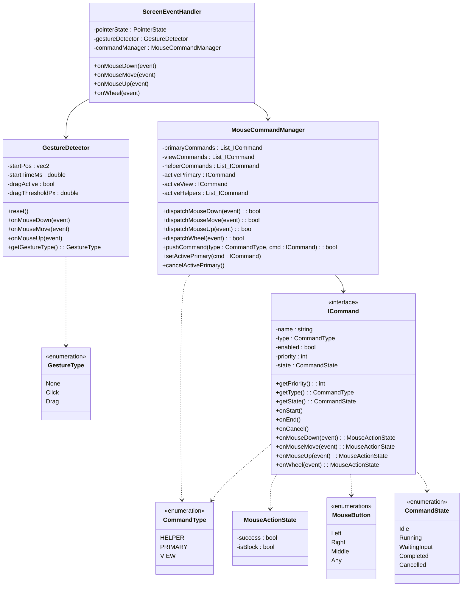

```mermaid
classDiagram
    class MouseButton {
        <<enumeration>>
        Left
        Right
        Middle
        Any
    }

    class GestureType {
        <<enumeration>>
        None
        Click
        Drag
    }

    class CommandType {
        <<enumeration>>
        HELPER
        PRIMARY
        VIEW
    }

    class CommandState {
        <<enumeration>>
        Idle
        Running
        WaitingInput
        Completed
        Cancelled
    }

    class MouseActionState {
        -success : bool
        -isBlock : bool
    }

    class ScreenEventHandler {
        -pointerState : PointerState
        -gestureDetector : GestureDetector
        -commandManager : MouseCommandManager
        +onMouseDown(event)
        +onMouseMove(event)
        +onMouseUp(event)
        +onWheel(event)
    }

    class GestureDetector {
        -startPos : vec2
        -startTimeMs : double
        -dragActive : bool
        -dragThresholdPx : double
        +reset()
        +onMouseDown(event)
        +onMouseMove(event)
        +onMouseUp(event)
        +getGestureType() : GestureType
    }

    class ICommand {
        <<interface>>
        -name : string
        -type : CommandType
        -enabled : bool
        -priority : int
        -state : CommandState
        +getPriority() : int
        +getType() : CommandType
        +getState() : CommandState
        +onStart()
        +onEnd()
        +onCancel()
        +onMouseDown(event) : MouseActionState
        +onMouseMove(event) : MouseActionState
        +onMouseUp(event) : MouseActionState
        +onWheel(event) : MouseActionState
    }

    class MouseCommandManager {
        -primaryCommands : List_ICommand
        -viewCommands : List_ICommand
        -helperCommands : List_ICommand
        -activePrimary : ICommand
        -activeView : ICommand
        -activeHelpers : List_ICommand
        +dispatchMouseDown(event) : bool
        +dispatchMouseMove(event) : bool
        +dispatchMouseUp(event) : bool
        +dispatchWheel(event) : bool
        +pushCommand(type : CommandType, cmd : ICommand) : bool
        +setActivePrimary(cmd : ICommand)
        +cancelActivePrimary()
    }

    ScreenEventHandler --> GestureDetector
    ScreenEventHandler --> MouseCommandManager

    GestureDetector ..> GestureType
    MouseCommandManager ..> CommandType
    MouseCommandManager --> ICommand

    ICommand ..> MouseActionState
    ICommand ..> CommandType
    ICommand ..> MouseButton
    ICommand ..> CommandState
```

```mermaid
classDiagram
    %% --- Enums ---
    class MouseButton {
        <<enumeration>>
        Left
        Right
        Middle
    }

    class CommandType {
        <<enumeration>>
        HELPER    
        VIEW      
        PRIMARY   
    }

    class CommandStatus {
        <<enumeration>>
        Running   
        Finished  
        Cancelled 
    }

    %% --- Data Structures ---
    class MouseEventData {
        +vec2 screenPos
        +vec2 worldPos
        +MouseButton button
        +bool isShiftDown
        +bool isCtrlDown
    }

    class MouseActionResult {
        +CommandStatus status
        +bool isHandled  
        +bool isBlockLayer 
        %% isHandled: Đã dùng event này chưa?
        %% isBlockLayer: Có chặn layer thấp hơn (Primary) không?
    }

    %% --- Context (The "World" access) ---
    class CADContext {
        +Camera camera
        +Document document
        +SnappingEngine snapEngine
        +ProjectPoint(screenPos): vec2
        +UnprojectPoint(worldPos): vec2
        +Redraw()
    }

    %% --- Core Handling ---
    class GestureDetector {
        -vec2 startPos
        -bool isDragging
        +Update(MouseEventData)
        +IsClick(): bool
        +IsDrag(): bool
    }

    class ScreenEventHandler {
        -MouseCommandManager commandManager
        -GestureDetector gestureDetector
        +OnInputEvent(rawEvent)
    }

    %% --- Command Architecture ---
    class ICommand {
        <<interface>>
        -string name
        -CommandType type
        +OnStart(CADContext context)
        +OnEnd()
        +OnCancel()
        +OnMouseDown(MouseEventData): MouseActionResult
        +OnMouseMove(MouseEventData): MouseActionResult
        +OnMouseUp(MouseEventData): MouseActionResult
        +OnWheel(float delta): MouseActionResult
    }

    class MouseCommandManager {
        -CADContext context
        -vector~ICommand~ helpers  
        -vector~ICommand~ views    
        -stack~ICommand~ primaryStack 
        
        +PushCommand(ICommand cmd)
        +PopCommand()
        +DispatchEvent(MouseEventData)
    }

    %% --- Concrete Examples (Implicit) ---
    %% Helper: SnapCommand, HoverHighlightCommand
    %% View: PanCommand, ZoomCommand
    %% Primary: DrawLineCommand, ModifyEntityCommand

    %% --- Relationships ---
    ScreenEventHandler --> GestureDetector
    ScreenEventHandler --> MouseCommandManager
    
    MouseCommandManager --> ICommand : manages
    MouseCommandManager --> CADContext : holds
    
    ICommand ..> MouseActionResult : returns
    ICommand ..> CommandStatus : uses
    ICommand ..> CADContext : uses
    ICommand ..> MouseEventData : inputs

    note for MouseCommandManager "Dispatch Loop Priority:\n1. Helpers (Snap/Highlight)\n2. Views (Pan/Zoom)\n3. Active Primary (Draw/Edit)"
    note for ICommand "State Machine Logic\nlives inside concrete\nimplementations of this interface"
```
