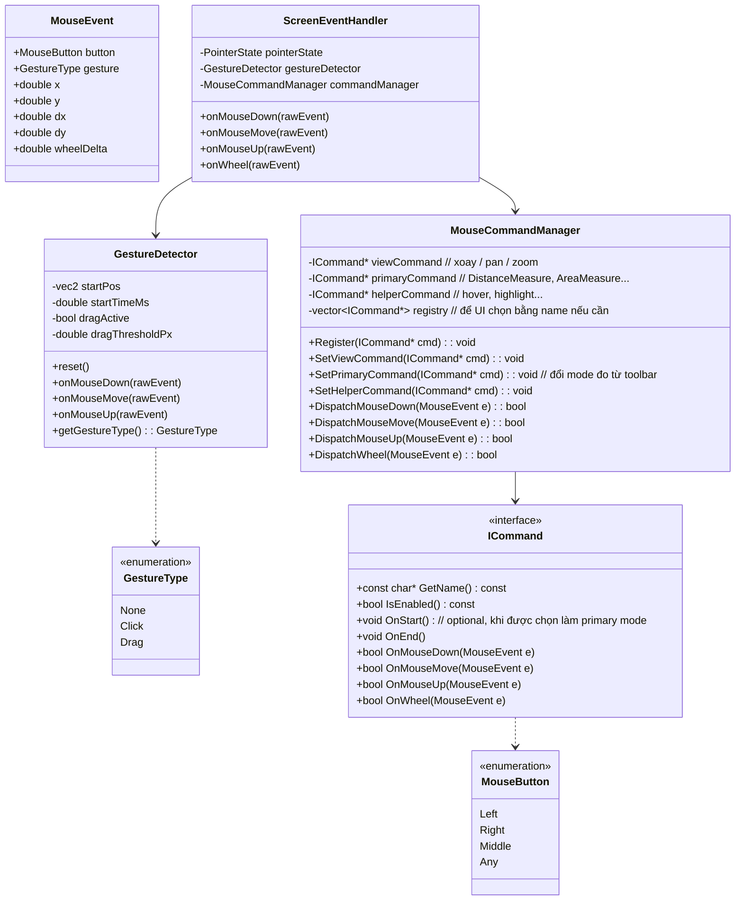

```mermaid
classDiagram
    class MouseButton {
        <<enumeration>>
        Left
        Right
        Middle
        Any
    }

    class GestureType {
        <<enumeration>>
        None
        Click
        Drag
    }

    class MouseEvent {
        +MouseButton button
        +GestureType gesture
        +double x
        +double y
        +double dx
        +double dy
        +double wheelDelta
    }

    class ScreenEventHandler {
        -PointerState pointerState
        -GestureDetector gestureDetector
        -MouseCommandManager commandManager
        +onMouseDown(rawEvent)
        +onMouseMove(rawEvent)
        +onMouseUp(rawEvent)
        +onWheel(rawEvent)
    }

    class GestureDetector {
        -vec2 startPos
        -double startTimeMs
        -bool dragActive
        -double dragThresholdPx
        +reset()
        +onMouseDown(rawEvent)
        +onMouseMove(rawEvent)
        +onMouseUp(rawEvent)
        +getGestureType(): GestureType
    }

    class ICommand {
        <<interface>>
        +const char* GetName() const
        +bool IsEnabled() const
        +void OnStart()      // optional, khi được chọn làm primary mode
        +void OnEnd()
        +bool OnMouseDown(MouseEvent e)
        +bool OnMouseMove(MouseEvent e)
        +bool OnMouseUp(MouseEvent e)
        +bool OnWheel(MouseEvent e)
    }

    class MouseCommandManager {
        -ICommand* viewCommand      // xoay / pan / zoom
        -ICommand* primaryCommand   // DistanceMeasure, AreaMeasure...
        -ICommand* helperCommand    // hover, highlight...
        -vector~ICommand*~ registry // để UI chọn bằng name nếu cần

        +Register(ICommand* cmd): void
        +SetViewCommand(ICommand* cmd): void
        +SetPrimaryCommand(ICommand* cmd): void   // đổi mode đo từ toolbar
        +SetHelperCommand(ICommand* cmd): void

        +DispatchMouseDown(MouseEvent e): bool
        +DispatchMouseMove(MouseEvent e): bool
        +DispatchMouseUp(MouseEvent e): bool
        +DispatchWheel(MouseEvent e): bool
    }

    ScreenEventHandler --> GestureDetector
    ScreenEventHandler --> MouseCommandManager
    GestureDetector ..> GestureType

    MouseCommandManager --> ICommand
    ICommand ..> MouseButton


```

```mermaid
classDiagram
    %% --- Enums ---
    class MouseButton {
        <<enumeration>>
        Left
        Right
        Middle
    }

    class CommandType {
        <<enumeration>>
        HELPER    
        VIEW      
        PRIMARY   
    }

    class CommandStatus {
        <<enumeration>>
        Running   
        Finished  
        Cancelled 
    }

    %% --- Data Structures ---
    class MouseEventData {
        +vec2 screenPos
        +vec2 worldPos
        +MouseButton button
        +bool isShiftDown
        +bool isCtrlDown
    }

    class MouseActionResult {
        +CommandStatus status
        +bool isHandled  
        +bool isBlockLayer 
        %% isHandled: Đã dùng event này chưa?
        %% isBlockLayer: Có chặn layer thấp hơn (Primary) không?
    }

    %% --- Context (The "World" access) ---
    class CADContext {
        +Camera camera
        +Document document
        +SnappingEngine snapEngine
        +ProjectPoint(screenPos): vec2
        +UnprojectPoint(worldPos): vec2
        +Redraw()
    }

    %% --- Core Handling ---
    class GestureDetector {
        -vec2 startPos
        -bool isDragging
        +Update(MouseEventData)
        +IsClick(): bool
        +IsDrag(): bool
    }

    class ScreenEventHandler {
        -MouseCommandManager commandManager
        -GestureDetector gestureDetector
        +OnInputEvent(rawEvent)
    }

    %% --- Command Architecture ---
    class ICommand {
        <<interface>>
        -string name
        -CommandType type
        +OnStart(CADContext context)
        +OnEnd()
        +OnCancel()
        +OnMouseDown(MouseEventData): MouseActionResult
        +OnMouseMove(MouseEventData): MouseActionResult
        +OnMouseUp(MouseEventData): MouseActionResult
        +OnWheel(float delta): MouseActionResult
    }

    class MouseCommandManager {
        -CADContext context
        -vector~ICommand~ helpers  
        -vector~ICommand~ views    
        -stack~ICommand~ primaryStack 
        
        +PushCommand(ICommand cmd)
        +PopCommand()
        +DispatchEvent(MouseEventData)
    }

    %% --- Concrete Examples (Implicit) ---
    %% Helper: SnapCommand, HoverHighlightCommand
    %% View: PanCommand, ZoomCommand
    %% Primary: DrawLineCommand, ModifyEntityCommand

    %% --- Relationships ---
    ScreenEventHandler --> GestureDetector
    ScreenEventHandler --> MouseCommandManager
    
    MouseCommandManager --> ICommand : manages
    MouseCommandManager --> CADContext : holds
    
    ICommand ..> MouseActionResult : returns
    ICommand ..> CommandStatus : uses
    ICommand ..> CADContext : uses
    ICommand ..> MouseEventData : inputs

    note for MouseCommandManager "Dispatch Loop Priority:\n1. Helpers (Snap/Highlight)\n2. Views (Pan/Zoom)\n3. Active Primary (Draw/Edit)"
    note for ICommand "State Machine Logic\nlives inside concrete\nimplementations of this interface"
```
