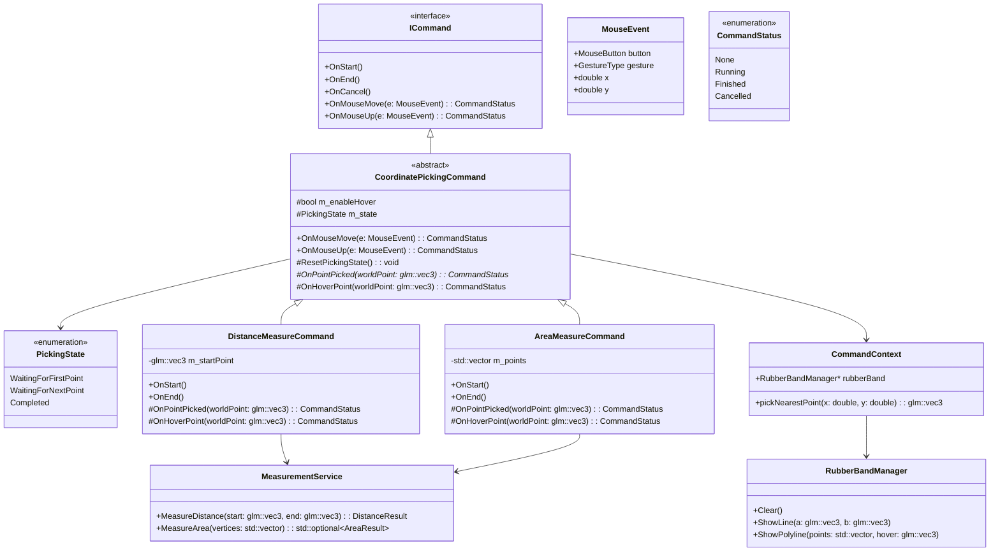

```mermaid
classDiagram
    class ICommand {
        <<interface>>
        +OnStart()
        +OnEnd()
        +OnCancel()
        +OnMouseMove(e: MouseEvent): CommandStatus
        +OnMouseUp(e: MouseEvent): CommandStatus
    }

    class CoordinatePickingCommand {
        <<abstract>>
        #bool m_enableHover
        #PickingState m_state
        +OnMouseMove(e: MouseEvent): CommandStatus
        +OnMouseUp(e: MouseEvent): CommandStatus
        #ResetPickingState(): void
        #OnPointPicked(worldPoint: glm::vec3): CommandStatus*
        #OnHoverPoint(worldPoint: glm::vec3): CommandStatus
    }

    class PickingState {
        <<enumeration>>
        WaitingForFirstPoint
        WaitingForNextPoint
        Completed
    }

    class DistanceMeasureCommand {
        -glm::vec3 m_startPoint
        +OnStart()
        +OnEnd()
        #OnPointPicked(worldPoint: glm::vec3): CommandStatus
        #OnHoverPoint(worldPoint: glm::vec3): CommandStatus
    }

    class AreaMeasureCommand {
        -std::vector<glm::vec3> m_points
        +OnStart()
        +OnEnd()
        #OnPointPicked(worldPoint: glm::vec3): CommandStatus
        #OnHoverPoint(worldPoint: glm::vec3): CommandStatus
    }

    class CommandContext {
        +RubberBandManager* rubberBand
        +pickNearestPoint(x: double, y: double): glm::vec3
    }

    class RubberBandManager {
        +Clear()
        +ShowLine(a: glm::vec3, b: glm::vec3)
        +ShowPolyline(points: std::vector<glm::vec3>, hover: glm::vec3)
    }

    class MeasurementService {
        +MeasureDistance(start: glm::vec3, end: glm::vec3): DistanceResult
        +MeasureArea(vertices: std::vector<glm::vec3>): std::optional~AreaResult~
    }

    class MouseEvent {
        +MouseButton button
        +GestureType gesture
        +double x
        +double y
    }

    class CommandStatus {
        <<enumeration>>
        None
        Running
        Finished
        Cancelled
    }

    ICommand <|-- CoordinatePickingCommand
    CoordinatePickingCommand <|-- DistanceMeasureCommand
    CoordinatePickingCommand <|-- AreaMeasureCommand

    CoordinatePickingCommand --> PickingState

    CoordinatePickingCommand --> CommandContext
    CommandContext --> RubberBandManager

    DistanceMeasureCommand --> MeasurementService
    AreaMeasureCommand --> MeasurementService

```

