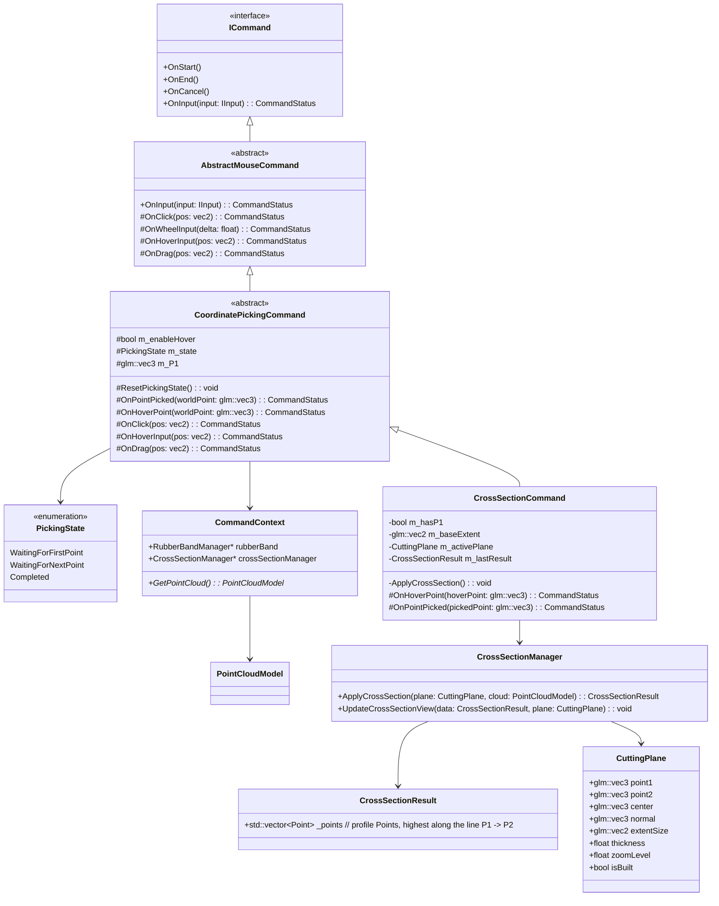

Tasks break down:
1. Define behavior + state machine (Center -> pick P1 -> pick P2-valid-opposite-side) + rubberband preview: 1 day

2. Implement CrossSectionCommand logic (opposite-side validation, plane build, output result): 1 day

3. Implement profile extraction in CrossSectionManager (highest height along P1->P2, thickness filter): 2 days

4. Cross-section view update. Send CuttingPlane and CrossSectionResult to CrossSectionCanvas View: 2 day

5. Testing and Backup: 2 day

Total: 8 days




```
class CrossSectionCommand : public CoordinatePickingCommand {
private:
    bool m_hasP1 = false;

    glm::vec2 m_baseExtent{100.0f, 80.0f};

    CuttingPlane m_activePlane;
    CrossSectionResult m_lastResult;
    void ApplyCrossSection() {
        m_lastResult = m_context.crossSectionManager->ApplyCrossSection(
            m_activePlane, *m_context.GetPointCloud());

        m_context.crossSectionManager->UpdateCrossSectionView(
            m_lastResult, m_activePlane);
    }
protected:
    CommandStatus OnHoverPoint(const glm::vec3& hoverPoint) override {
        if (m_state == PickingState::WaitingForNextPoint) {
            m_context.rubberBand->ShowLine(m_P1, hoverPoint);
        }
        return CommandStatus::Finished;
    }
    CommandStatus OnPointPicked(const glm::vec3& pickedPoint) override {
        CuttingPlane& plane = m_activePlane;

        if (m_state == PickingState::WaitingForFirstPoint) {
            plane.center = pickedPoint;
            m_state = PickingState::WaitingForNextPoint;
            m_hasP1 = false;
            return CommandStatus::None;
        }

        if (m_state == PickingState::WaitingForNextPoint && !m_hasP1) {
            plane.point1 = pickedPoint;
            m_hasP1 = true;
            return CommandStatus::None;
        }

        if (m_state == PickingState::WaitingForNextPoint && m_hasP1) {
            if (!IsOppositeSide(...)) return CommandStatus::None;

            plane.point2 = pickedPoint;
            plane.normal = dot(point2-point1, Vector.up)
            plane.isBuilt = true;
            ApplyCrossSection();
            m_state = PickingState::Completed;
            return CommandStatus::Finished;
        }

        // Restart
        if (m_state == PickingState::Completed) {
            OnStart();
        }

        return CommandStatus::None;
    }
public:
    void OnStart() override {
        ResetPickingState();
        m_P1 = glm::vec3(0.0f);
        m_P2 = glm::vec3(0.0f);
        m_context.rubberBand->Clear();
        
        m_activePlane = CuttingPlane();
        m_enableHover = true;
    }

    void OnEnd() override {
        m_context.rubberBand->Clear();
    }

};

```

```
//  Data Structure for the Slicing Plane
struct CuttingPlane {
    glm::vec3 point1{0.0f, 0.0f, 0.0f};
    glm::vec3 point2{0.0f, 0.0f, 0.0f};
    glm::vec3 center{0.0f, 0.0f, 0.0f};
    glm::vec3 normal{0.0f, 0.0f, 1.0f};

    // width and height of the plane 
    glm::vec2 extentSize = glm::vec2(100.0f, 80.0f);
    float thickness;
    float zoomLevel = 1.0f;
    bool isBuilt; // isHaveEnought 
};

// Contain points data that in Cutting plane
struct CrossSectionResult {     
        std::vector<Point>  _points; // highest points along P1->P2
};

class CrossSectionManager {
public:
     CrossSectionResult ApplyCrossSection(const CuttingPlane& plane,
                                         const PointCloudModel& sourceCloud)
    {
        return BuildProfilePoint(plane, sourceCloud);
    }


    void UpdateCrossSectionView(const CrossSectionResult& data, const CuttingPlane& cuttingPlane) {
       // Update Cross
    }
private:
    CrossSectionResult BuildProfilePoint(const CuttingPlane& plane, const PointCloudModel& srcCloud){
        CrossSectionResult result;
        //find highest points along the line P1 -> P2
        return result;
    }
};

// CommandContext remains the same
struct CommandContext {
    RubberBandManager* rubberBand;
    CrossSectionManager* crossSectionManager;
    PointCloudModel* GetPointCloud();
    glm::vec3 pickNearestPoint(double x, double y);
    //...
};

```
