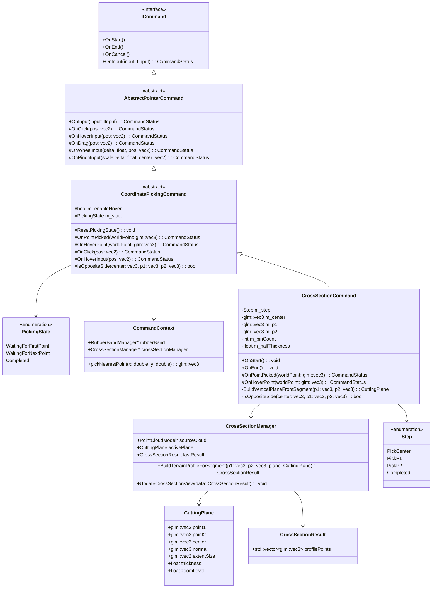

Tasks break down:
1. Define behavior + state machine (Center -> pick P1 -> pick P2-valid-opposite-side) + rubberband preview: 1 day

2. Implement CrossSectionCommand logic (opposite-side validation, plane build, output result): 1 day

3. Implement profile extraction in CrossSectionManager (highest height per bin along P1->P2, thickness filter): 2 days

4. Cross-section view update. Send CuttingPlane and CrossSectionResult to CrossSectionCanvas View: 2 day

5. Testing and Backup: 2 day

Total: 8 days

