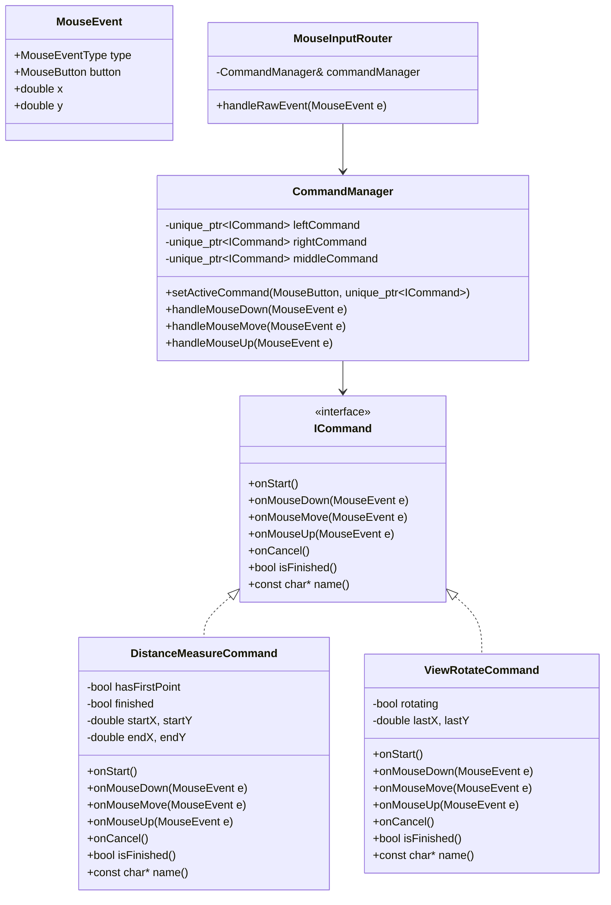
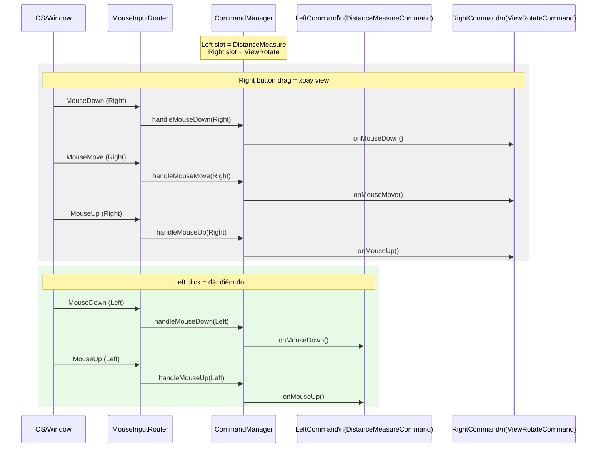

CHART:

```mermaid
flowchart LR
    subgraph Input["Window / OS"]
        Raw["Raw Mouse Events"]
    end

    Raw --> MIR["MouseInputRouter"]

    subgraph Core["Core Input Layer"]
        MIR --> CM["CommandManager
                    (per-button slots)"]
    end

    subgraph Slots["Command Slots"]
        LSlot["LeftCommand
        (e.g. DistanceMeasureCommand)"]
        RSlot["RightCommand
        (e.g. ViewRotateCommand)"]
        MSlot["MiddleCommand
        (optional)"]
    end

    CM --> LSlot
    CM --> RSlot
    CM --> MSlot

    subgraph Commands["Concrete Commands"]
        DMC["DistanceMeasureCommand"]
        AMC["AreaMeasureCommand"]
        VRC["ViewRotateCommand"]
    end

    LSlot --> DMC
    LSlot --> AMC
    RSlot --> VRC
```

```mermaid
classDiagram
    class MouseEvent {
        +MouseEventType type
        +MouseButton button
        +double x
        +double y
    }

    class ICommand {
        <<interface>>
        +onStart()
        +onMouseDown(MouseEvent e)
        +onMouseMove(MouseEvent e)
        +onMouseUp(MouseEvent e)
        +onCancel()
        +bool isFinished()
        +const char* name()
    }

    class DistanceMeasureCommand {
        -bool hasFirstPoint
        -bool finished
        -double startX, startY
        -double endX, endY
        +onStart()
        +onMouseDown(MouseEvent e)
        +onMouseMove(MouseEvent e)
        +onMouseUp(MouseEvent e)
        +onCancel()
        +bool isFinished()
        +const char* name()
    }

    class ViewRotateCommand {
        -bool rotating
        -double lastX, lastY
        +onStart()
        +onMouseDown(MouseEvent e)
        +onMouseMove(MouseEvent e)
        +onMouseUp(MouseEvent e)
        +onCancel()
        +bool isFinished()
        +const char* name()
    }

    class CommandManager {
        -unique_ptr~ICommand~ leftCommand
        -unique_ptr~ICommand~ rightCommand
        -unique_ptr~ICommand~ middleCommand
        +setActiveCommand(MouseButton, unique_ptr~ICommand~)
        +handleMouseDown(MouseEvent e)
        +handleMouseMove(MouseEvent e)
        +handleMouseUp(MouseEvent e)
    }

    class MouseInputRouter {
        -CommandManager& commandManager
        +handleRawEvent(MouseEvent e)
    }

    ICommand <|.. DistanceMeasureCommand
    ICommand <|.. ViewRotateCommand
    MouseInputRouter --> CommandManager
    CommandManager --> ICommand
```

```mermaid
sequenceDiagram
    participant OS as OS/Window
    participant MIR as MouseInputRouter
    participant CM as CommandManager
    participant LCmd as LeftCommand\n(DistanceMeasureCommand)
    participant RCmd as RightCommand\n(ViewRotateCommand)

    Note over CM: Left slot = DistanceMeasure<br/>Right slot = ViewRotate

    rect rgb(240,240,240)
        Note over OS,RCmd: Right button drag = xoay view
        OS->>MIR: MouseDown (Right)
        MIR->>CM: handleMouseDown(Right)
        CM->>RCmd: onMouseDown()

        OS->>MIR: MouseMove (Right)
        MIR->>CM: handleMouseMove(Right)
        CM->>RCmd: onMouseMove()

        OS->>MIR: MouseUp (Right)
        MIR->>CM: handleMouseUp(Right)
        CM->>RCmd: onMouseUp()
    end

    rect rgb(230,250,230)
        Note over OS,LCmd: Left click = đặt điểm đo
        OS->>MIR: MouseDown (Left)
        MIR->>CM: handleMouseDown(Left)
        CM->>LCmd: onMouseDown()

        OS->>MIR: MouseUp (Left)
        MIR->>CM: handleMouseUp(Left)
        CM->>LCmd: onMouseUp()
    end
```
