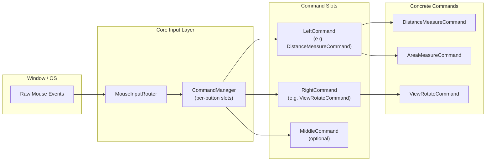
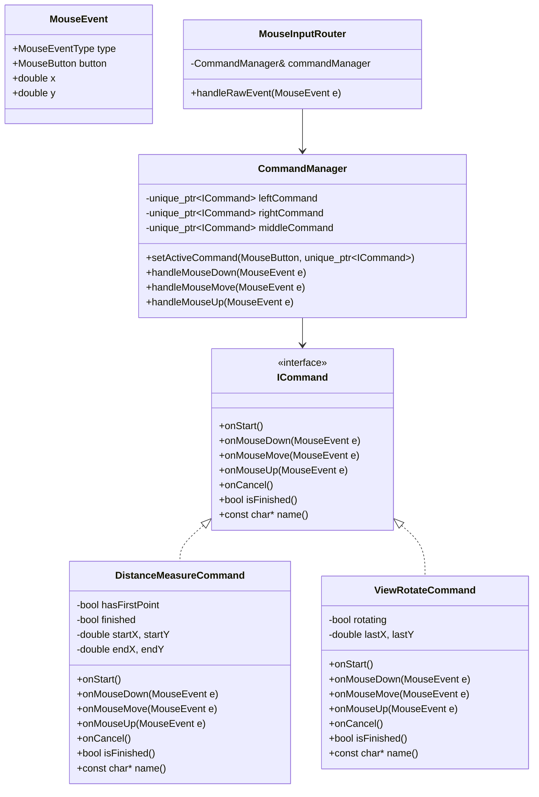

CHART:

```mermaid
flowchart LR
    subgraph Input["Window / OS"]
        Raw["Raw Mouse Events"]
    end

    Raw --> MIR["MouseInputRouter"]

    subgraph Core["Core Input Layer"]
        MIR --> CM["CommandManager\n(per-button slots)"]
    end

    subgraph Slots["Command Slots"]
        LSlot["LeftCommand\n(e.g. DistanceMeasureCommand)"]
        RSlot["RightCommand\n(e.g. ViewRotateCommand)"]
        MSlot["MiddleCommand\n(optional)"]
    end

    CM --> LSlot
    CM --> RSlot
    CM --> MSlot

    subgraph Commands["Concrete Commands"]
        DMC["DistanceMeasureCommand"]
        AMC["AreaMeasureCommand"]
        VRC["ViewRotateCommand"]
    end

    LSlot --> DMC
    LSlot --> AMC
    RSlot --> VRC
```

```mermaid
classDiagram
    class MouseEvent {
        +MouseEventType type
        +MouseButton button
        +double x
        +double y
    }

    class ICommand {
        <<interface>>
        +onStart()
        +onMouseDown(MouseEvent e)
        +onMouseMove(MouseEvent e)
        +onMouseUp(MouseEvent e)
        +onCancel()
        +bool isFinished()
        +const char* name()
    }

    class DistanceMeasureCommand {
        -bool hasFirstPoint
        -bool finished
        -double startX, startY
        -double endX, endY
        +onStart()
        +onMouseDown(MouseEvent e)
        +onMouseMove(MouseEvent e)
        +onMouseUp(MouseEvent e)
        +onCancel()
        +bool isFinished()
        +const char* name()
    }

    class ViewRotateCommand {
        -bool rotating
        -double lastX, lastY
        +onStart()
        +onMouseDown(MouseEvent e)
        +onMouseMove(MouseEvent e)
        +onMouseUp(MouseEvent e)
        +onCancel()
        +bool isFinished()
        +const char* name()
    }

    class CommandManager {
        -unique_ptr~ICommand~ leftCommand
        -unique_ptr~ICommand~ rightCommand
        -unique_ptr~ICommand~ middleCommand
        +setActiveCommand(MouseButton, unique_ptr~ICommand~)
        +handleMouseDown(MouseEvent e)
        +handleMouseMove(MouseEvent e)
        +handleMouseUp(MouseEvent e)
    }

    class MouseInputRouter {
        -CommandManager& commandManager
        +handleRawEvent(MouseEvent e)
    }

    ICommand <|.. DistanceMeasureCommand
    ICommand <|.. ViewRotateCommand
    MouseInputRouter --> CommandManager
    CommandManager --> ICommand
```
