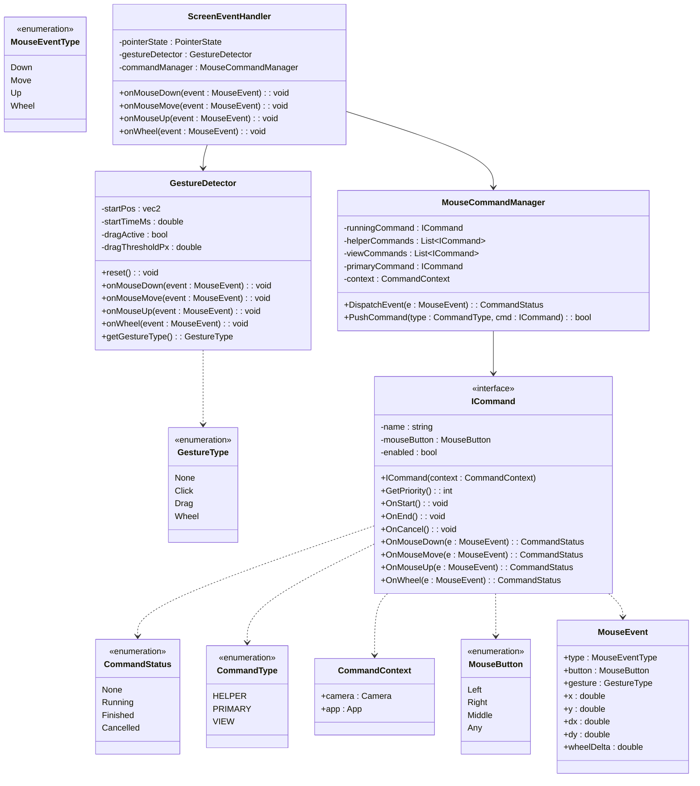

```mermaid
CommandStatus MouseCommandManager::DispatchEvent(const MouseEvent& e)
{
    auto invoke = [&](ICommand* cmd) -> CommandStatus {
        switch (e.type) {
        case MouseEventType::Down:  return cmd->OnMouseDown(e);
        case MouseEventType::Move:  return cmd->OnMouseMove(e);
        case MouseEventType::Up:    return cmd->OnMouseUp(e);
        case MouseEventType::Wheel: return cmd->OnWheel(e);
        }
        return CommandStatus::None;
    };

    // Running command (capture)
    if (runningCommand != nullptr) {
        CommandStatus status = invoke(runningCommand);
        if (status == CommandStatus::Finished || status == CommandStatus::Cancelled) {
            runningCommand = nullptr; // allow event to go down
        } else if (status == CommandStatus::Running) {
            return status;            // stop here
        }
    }

    // [LAYER 1] Helper
    for (auto* helper : helperCommands) {
        CommandStatus status = invoke(helper);
        if (status == CommandStatus::Running) {
            runningCommand = helper;
            return status;
        }
    }

    // [LAYER 2] View (Pan, Rotate, Wheel zoom)
    for (auto* view : viewCommands) {
        CommandStatus status = invoke(view);
        if (status == CommandStatus::Running) {
            runningCommand = view;
            return status;
        }
    }

    // [LAYER 3] Primary (Draw Line, Select, Measure)
    if (primaryCommand != nullptr) {
        CommandStatus status = invoke(primaryCommand);
        if (status == CommandStatus::Running) {
            runningCommand = primaryCommand;
        } else if (status == CommandStatus::Finished) {
            primaryCommand->OnEnd();
        } else if (status == CommandStatus::Cancelled) {
            primaryCommand->OnCancel();
        }
        return status;
    }

    return CommandStatus::None;
}

```
